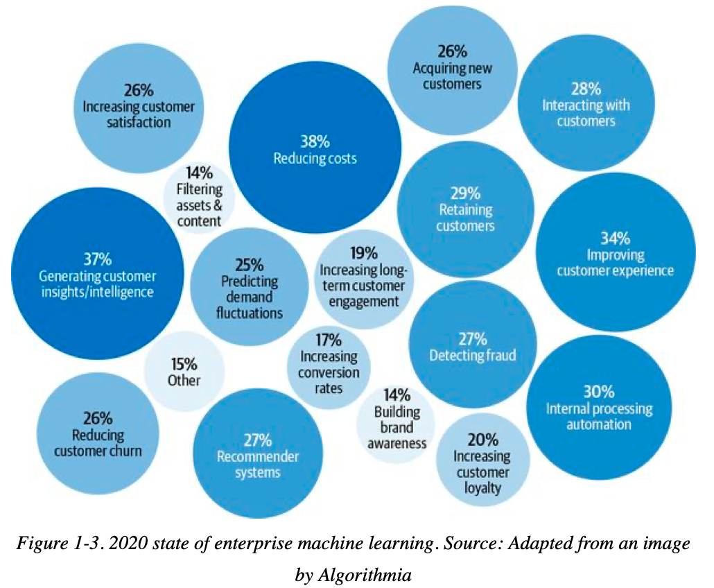

# 1 - Overview of ML Systems

# When to use ML (and when not to)

 ## Problem characteristics needed for ML solutions to work
Some problems tend to be a better fit than others for ML solutions. Even in cases where both traditional software engineering and ML are viable options, ML may not be the optimal solution.

The book contains the following definition of what a (supervised) ML system generally does. In order for a problem to be  solvable by ML, it requires certain characteristics encoded in the definition.

> Machine learning is an approach to (2) learn complex patterns from (1) existing data and use these patterns to make (3) predictions on (4) unseen data . 

**1. Existing data: data is available or it is possible to collect it.** 

If you don't have sufficient data and you don't have a mechanism to gather it, then an ML approach will not work. In the case of supervised learning, you need sufficient **labelled** data.

- *Zero-shot / few-shot learning techniques* allow making predictions without having to train a model using data for your specific task.  However, these typically rely on pre-trained models.
- Continuous learning techniques are also available. These imply deploying models with no training to production and use the production data for either online incremental training, reinforcement learning or future offline training.  Deploying untrained models to production comes with a risk.
- **Fake it till you make it** is also popular among companies: launch a product that serves predictions made by humans, instead of ML models, with the hope of using the generated data to train ML models later. 

**2. Complex patterns: there are patterns to learn, and they are complex.**

- If you have data but there is no pattern to learn, then an ML approach doesn't make sense. For example, it doesn't make sense to build an ML system to predict the outcome for a fair die. 

- If there are patterns but they are simple, it probably makes more sense to use a pure software engineering solution for the problem (e.g. don't build an ML system to look for zip codes based on address, just use a lookup table).

  
**3. The problem can be framed as a prediction problem.**

- Supervised ML models make predictions. If the whole problem  (or part of it) cannot be framed as a prediction problem, supervised ML is not the right tool.
- Many computationally intensive problems are getting reframed as prediction problems. An example of this is light rendering in video games. Instead of doing the full expensive computation of what the lighting should be exactly, a regression ML model can be used to get a "good enough" approximation. In this case training the model is cheaper than doing the calculation.

4. **Unseen data shares patterns with the train data.**

- Your model only works well if the patterns in the production data are the same than the ones in the training data.
- *If the data is unseen, how do we know what distribution it comes from?* We don't, we just make a reasonable assumption that it is. We can retrospectively check if our assumption was true by monitoring in production (chapter 8) and testing in production (chapter 9).

## Problem characteristics that will make ML solutions especially useful
These are not necessary characteristics, but having one or multiple of them make it much more likely that an ML approach will succeed for a problem. 

1. **It is a repetitive task:**  if a task is repetitive, patterns will be repeated multiple times and the ML models will be able to learn better.
2. **The cost of wrong predictions is cheap**: ML models will make wrong predictions. When mistakes are cheap, stakes are lower, making it easier to build and deploy ML models. Models can still be built when the consequences of a wrong prediction are catastrophic if on average the benefits of correct predictions outweigh the costs of the wrong ones. Self-driving cars are a good example for this when considering that automated cars on average are safer than cars driven by humans.
3. **The task happens at scale:** deploying ML models to production is hard. This work is more justifiable when the model will be used to make lots of predictions. Also, if the task happens at scale, there will be lots of data to train from.
4. **The patterns are constantly changing:** ML shines against traditional software rules when patterns change frequently, causing hardcoded rules get outdated too fast.  Changes in spam trends and culture trends are examples of changing patterns.

## Typical ML use cases
ML is being used both for **consumer** facing applications and **enterprise** internal applications. Consumer ML applications is growing; however, as of 2022, the vast majority of applications is still in the enterprise space.

- In **consumer** applications latency tends to be more important than accuracy. Increases in latency may cause the user to bounce from our app. Consumers also tend to be more forgiving with bad predictions in non-critical applications like recommending a movie or bad tagging of a photo.
- In **enterprise** applications, accuracy tends to be more important than latency. Small increases in accuracy can save millions of dollars per year.  The image below shows the breakdown of ML enterprise applications. These are some examples:
  - Use ML to reduce cost of customer acquisition (CAC): show better targeted ads, show discounts at the right moment. On  2019, the average CAC for a user that makes an in-app purchase is US $86 61. High CAC is a startup killer.
  - Churn prediction:  Acquiring a new customer is 5 to 25 times more expensive than retaining one.
  - Brand monitoring: Monitor the sentiment of the public in social media towards your brand. 

# ML in research vs production
Research ML and production ML are different. It is important to be aware of the differences to avoid the pitfalls that arise from trying to use a research mentality to production models.

|                        | Research                                                     | Production                                             |
| ---------------------- | ------------------------------------------------------------ | ------------------------------------------------------ |
| Requirements           | State-of-the-art model performance with benchmark datasets (1) | Different stakeholders have different requirements (2) |
| Computational priority | Fast training, high query throughput (3)                     | Fast inference with low latency (4) (5) (6)            |
| Data                   | Often Static                                                 | Constantly shifting                                    |
| Fairness               | Often not a focus                                            | Must be considered (7)                                 |
| Interpretability       | Often not a focus, performance is the north start (8)        | Must be considered                                     |

(1) No focus on model deployment and maintenance.

(2) MLEs, Sales teams, Product Managers, ML platform teams all have different requirements for the same system.

(3) Most modern systems batch up queries at inference time. In research, it doesn't matter if the time to answer a single query is high as long as the throughput of predictions for the whole test dataset is acceptable. In production, the time to answer a single query is important, so we need to balance that with the throughput.

(4)  `...once you deploy your model into the real world, latency matters a lot. In 2017, an Akamai study found that a 100 ms delay can hurt conversion rates by 7%. 20 In 2019, Booking.com found that an increase of about 30% in latency cost about 0.5% in conversion rates—“a relevant cost for our business.” 21 In 2016, Google found that more than half of mobile users will leave a page if it takes more than three seconds to load. 22 Users today are even less patient.` 

(5) Latency must be monitored using percentiles, not averages. Don't ignore higher percentiles like p90 through p99 as the most valuable customers, tend to be the ones with more data and the ones that experience slower inferences.

(6) Consider using high percentiles like p90 to specify the latency requirements of the system.

(7) ML systems encode the past and perpetuate the biases the training data has. To make things worse, ML systems can discriminate at scale potentially affecting millions of people. 

(8) For example, *ensemble models* are common in research but very uncommon in production because of their low interpretability and high complexity.

# ML systems vs traditional software
On the surface, bringing SWE best practices to ML engineering is a good idea. However, it is not that simple. SWE systems keep data and code separate by design and the efforts of versioning, testing, deploying and monitoring are focused on the  **code** artefacts.  

ML systems are part code, part data and part artefacts created from the two. **All of these need to be versioned,  tested, deployed and monitored.**

Challenges:

- How to version data?
- How to test that a data sample is good or bad for the system?
- How to deploy a trained model with millions of parameters that requires gigabytes of RAM? How to do so if it needs to be deposed on the edge?
- How to monitor and debug deployed models considering they may be hard to interpret?

