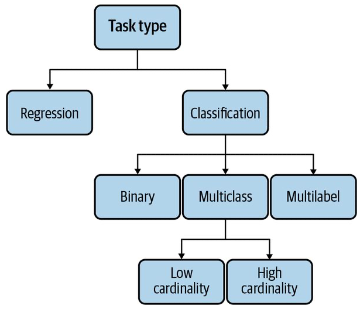
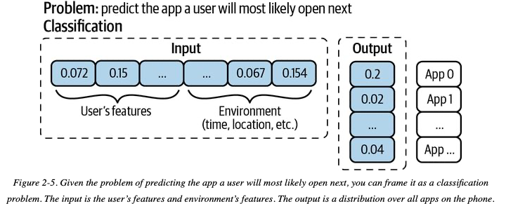
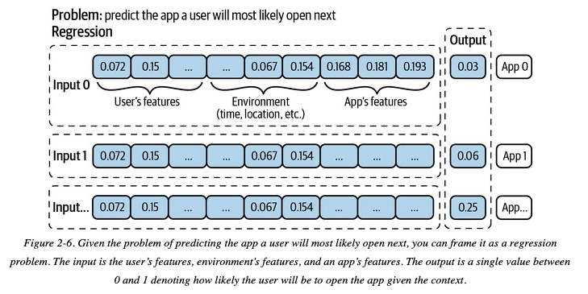

# 2 - Project objectives, requirements and framing

Once you have determined that an ML solution is feasible for your problem (as described in [chapter 1](01-overview-of-ml-systems.md)), it is time to align the **business** objectives with the **ml objectives**  and define operational **requirements**  that the system needs to satisfy.

Additionally, this chapter also covers how  **problem framing** can affect how easy or hard building and maintaining your solution will be.

# The relationship between business and ML objectives 
- Companies don't care about fancy ML metrics like `accuracy`, `precision`, `recall`, `F1`, etc. ML projects where data scientist become too focused on hacking ML metrics without paying attention to business metrics tend to fail.  For an ML project to succeed long term within a business organisation, it is crucial to **tie the performance of an ML system to some business performance metrics** (e.g. revenue, monthly active users, etc).
- **Mapping business to ML objectives is easier for certain ML applications than for others.** For example,  the business impact of fraud detection systems in financial applications is very clear and easy to measure. This mapping is much less obvious in, for example, ML systems used to detect potential cyber-security threats. Unsurprisingly, ML applications that have easier mappings (like fraud detection) are also [the most common types of enterprise ML applications](01-overview-of-ml-systems.md#Typical%20ML%20use%20cases)

- Many companies **create their own metrics to map business metrics to ML metrics**. For example, Netflix measures the performance of their recommender system using take-rate : the number of quality plays divided by the number of recommendations a user sees. The higher the take-rate, the better the recommender system. 

# Requirements for ML Systems
There are many requirements an ML system can have. However, you probably want to at least  think about  **reliability, scalability, maintainability** and **adaptability**. This section discusses what each of this mean in the context of an ML system.

### Reliability
- The system should continue to perform the correct function at the desired level of performance even in the face of adversity 

- Determining "correctness" in ML systems is harder than in software systems. ML systems can fail silently by, for example, continuing to produce predictions that are wrong. How can we tell a prediction is wrong if we don't know in advance the ground truth? 

### Scalability
- Consider the different axes in which an ML system needs to scale.
- ML systems can grow in model size (e.g. using more parameters), meaning that your hardware needs more RAM to work.
- ML systems can grow in traffic volume they serve. Your system needs to be able to keep up.
- ML systems can grow in number of models for a given use case. For example, first you only had a model to detect trending topics. Then you introduce a second model in that use case to filter out NSFW trending tweets.
- Resource scaling is not the only concern in scalability; so is artefact management. When you have hundreds of models you need a repeatable and programmatic way to monitor, retrain and deploy a model. You can probably do all these manually if you only have a few.
- The book touches more on the topic of scalability in other sections: Distributed Training, Model Optimisation, Resource Management, Experiment Tracking and Versioning, Development Environment.

### Maintainability
- People from many different backgrounds work in a single ML System (ML engineers, devOPs engineers, SMEs) etc. It is important to structure the workflow in a way that every group can work with the tools they are comfortable with as opposed to one group forcing a set of tools for everybody.
- Code should be documented, data and artefacts should be versioned.
- More on this topic in the "Team Structure section in Chapter 11". 

### Adaptability 
Data distributions and business requirements shift fast. Your system needs to be able to adapt to these natural shifts easily.

# Framing ML Problems
Business problems are typically not directly translatable to ML problems. There is some thinking you will need to do to figure out what *parts* of the business problem can be solved with ML. Once you identify that, the way you **frame** the sub-problem into an ML problem can make your life easier or harder and sometimes can make or break your project.

There are two things to consider when framing a problem: (1) the type of ML task you are going to use to model your problem, (2) The way you frame your objective function in problems that have multiple ML objectives.

## Types of supervised ML Tasks

* In classification, the fewer the clases there are, the simpler the problem. Binary classifiers are the simplest of all and they are widely used by ML practitioners.
* Multi-class: there are more than 2 labels to choose from but each observation can only be assigned one label.
  * High cardinality: there are *many* labels to choose from. For example, diseases names. High cardinality problems are hard.
* Multi-label: each observation can have more than one label. For example, a newspaper article could belong to both the *Science* and *Economy* labels. Multi-label classification problems are hard. 
* High cardinality multi-class that are also multi-label problems are very hard.

### Classification vs Regression framing
A regression model can easily be framed as a classification model and vice versa. 

- Regression models can be framed as classification problems if the continuous output labels are turned into discrete using buckets. For example `<100`, `100-200`, `>200`
- Classification problems can be framed as regression problems if the output is framed as a continuous variable between 0 and 1 and a threshold is used.  For example `if predicted_spam_score >= threshold: SPAM`.

### Multi-class classification framing 
- High-cardinality problems are hard. Check if you have other alternatives before committing to a multi-class model.

- Data collection for high-cardinality problems is challenging. ML models typically need at least 100 examples for each class to learn to classify that class. So if you have 1,000 classes, you already need at least 100,000 examples. The data collection can be especially difficult for rare classes. When you have thousands of classes, it’s likely that some of them are rare. 
-  When the number of classes is large, hierarchical classification might be useful. For example, have a first-pass classifier that identifies between `dog`, `cat` or `unicorn` . Then have another classifier for dogs that classifies the previously labelled `dogs` into `poodle`, `labrador`, `dalmatian, `etc.  These two articles touch on the subject of hierarchical classification:
  - [The Hitchhiker’s Guide to Hierarchical Classification](https://towardsdatascience.com/https-medium-com-noa-weiss-the-hitchhikers-guide-to-hierarchical-classification-f8428ea1e076) 
  - [Hierarchical Classification with Local Classifiers: Down the Rabbit Hole](https://towardsdatascience.com/hierarchical-classification-with-local-classifiers-down-the-rabbit-hole-21cdf3bd2382) 
- Some people try framing multi-class problems using multiple binary classifiers and then add a heuristic or meta-learner to make final prediction. For example, pick the label of the highest binary classifier.

### Multi-label classification framing
- Multi-label classification problems are hard because each observation can have a different amount of labels.

  - Data collection becomes hard because different label annotators might assign different number of labels to the same observation.
  - Extraction of labels from raw probabilities becomes ambiguous. For example if you have a a probability vector for a given observation that looks like this `[0.45, 0.2, 0.02, 0.33]`, it is unclear whether you need to select the top-1, top-2 or top-N probabilities to assign the label.

- There are two major approaches for multi-label classification.

  - Treat the problem as a multi-class problem creating a unique label for each label combination that is observed in the training data. For example, a newspaper article could be classified as `tech-finance` (one label) and another one as `tech` (another label). If the cardinality is large, this will make the cardinality even larger.

  - Use a set of label-specific binary classifiers that determine whether a given label should be assigned to a given observation. If several classifiers say "yes", then you have a multi-label observation.

### Example of why framing matters
The example below shows how a framing can make or break your project. The task is to predict which app is the user most likely to open next. The same problem is framed as a classification task and a regression task.

The classification framing fails miserably when a new app is installed because it requires the model to be retrained.

The framing as a regression task by introducing app features to predict an arbitrary "next use score" between 0 and 1, eliminates the need for retraining when a new app is installed. The only task that is needed in this case is extracting the `app features` vector and then use the same model.

## Objective Function Framing in Multi-objective Applications
Formally speaking there are many different objectives functions that can be used to train ML models and coming up with them requires deep knowledge of the math behind the models. However, in practice the choice of an objective function for a single model is usually easy. Most ML engineers use well known functions like **RSME** or **MAE** for regression, **log loss** for binary classification and **cross entropy** for multi-class classification.

The point of this section is NOT how to select the "right" objective function for your model.  It is how correctly **combine multiple objective functions** in problems with multiple objectives. This is easier to explain with an example.

Imagine your task is to build an ML system that ranks items on a user's news feed. To achieve these you sketch out this plan:

- Filter out irrelevant content (spam, NSFW content and misinformation)
- *Rank posts by quality* (measured in some numerical scale) => this means that the training process will seek to *minimise quality loss*
- *Rank posts by engagement (measured as the number of clicks in the post)* => This means that the training process will seek to *minimise engagement loss*

Your problem is a multi-objective problem that has two conflicting objectives: how do you rank a low quality but highly engaging post?  You need a single `ranking_score` number to be able to produce a single ranked list of items.

### The naive framing: create a single objective function
You could create a `ranking_score`  function and then train a model on that function (i.e minimize `ranking_loss`):

`ranking_score = alpha * quality_score + beta * engagement_score`

Then you test various `alpha` and `beta` to see what works best.

The problem with this is that every time you change `alpha` or `beta` you need to **fully retrain your model.**

### Smarter framing: Decoupling objectives
Alternatively you can train two independent models: one to predict `quality_score` and one to predict `engagement_score`. Then you can combine the output of both models ***after*** they have made predictions like so: `ranking_score = alpha * quality_score + beta * engagement_score`.  This time you can vary `alpha` and `beta` without having to retrain your models.

>In general, when there are multiple objectives, it’s a good idea to decouple them first because it makes model development and maintenance easier. First, it’s easier to tweak your system without retraining models, as previously explained. Second, it’s easier for maintenance since different objectives might need different maintenance schedules. 

- In this example, the decoupling allows us to update or retrain the `quality_model` more without affecting the engagement one.
