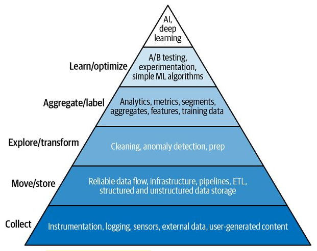
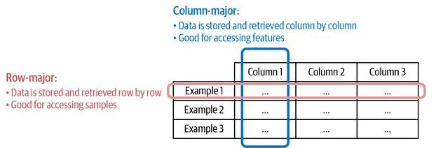
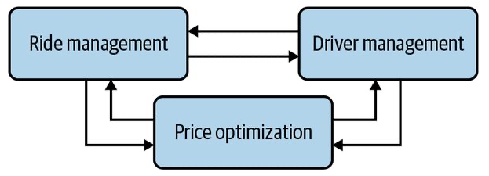

# 3 - Data Engineering Fundamentals
This chapter begins by highlighting the criticality of data through philosophical discussion on "data vs algorithm, which is more important?".

After that, the chapter systematically covers the different dimensions of "data in ML systems". Knowing the different dimensions will allow ML Engineers to understand systems better and make better choices.

# Quality of the algorithm vs quality and quantity of the data
- There is a big debate on whether the quality of ML in the future will continue to be driven by the quality and quantity of the data (as it has been so far) or by the quality of the training algorithms. People in the latter camp think that with the increase in compute power, smarter and more powerful algorithms will start to appear and they will make up for lower quality and quantity of data.

- The debate is still going. However, no one can deny the quality and quantity of the data is essential for now. This is why the most fundamental needs for machine learning are all data related and unrelated to model training.

*The data science hierarchy of needs. Adapted from an image by Monica Rogati*

# Data Sources 
Data to power ML systems usually comes from different sources.  Sources can be categorised as follows:

- **User input data:**  very varied in format: text, images, videos, files.  Malformed data is very common.

- **System generated data:** logs and system outputs like memory usage, cpu usage, metadata on user behaviour like clicks, scrolling, zooming, time spent on page. 

  -  Less likely to be malformed than user data. 
  - **Because debugging ML systems is hard, it is a common practice to log everything you can.**
  - The sheer amount of system-generated data has two challenges: getting signal from the noise and how to store a large number of logs. 

- **Internal databases:** these are the databases used by your software services to run your business.

- **Second-party data:** data that other company collects on their customers that is made available to you.

- **Third-party data:** data collected by companies on the public who aren't their customers. For example, apps that track all behaviour on the phone, even if they haven't opened an account.
  

# Data Formats
- The choice of format impacts human readability, speed of retrieval, speed of transmission and cost of storage.

- When deciding the data formats to use, think about how the data will be used in the future and choose a format that makes sense.

  | Format   | Binary/Text    | Human-readable | Example use cases             |
  | -------- | -------------- | -------------- | ----------------------------- |
  | JSON     | Text           | Yes            | Everywhere                    |
  | CSV      | Text           | Yes            | Everywhere                    |
  | Parquet  | Binary         | No             | Hadoop, Redshift              |
  | Avro     | Binary primary | No             | Hadoop                        |
  | Protobuf | Binary primary | No             | Google, TensorFlow            |
  | Pickle   | Binary         | No             | Python, PyTorch serialisation |

  *Samples of popular data formats*

## JSON
- Extremely popular. So popular, that the pain that it causes is felt everywhere.
- Good readability and very flexible.
- When you commit the data you implicitly commit to a schema that the reader will need to assume. 
- Retrospectively changing the schema of the data that was already stored is very painful.

## Text versus Binary Format
- Text formats are human readable, but larger in size. This means slower to transmit and retrieve.
- Binary formats are more compact but are not readable. Compactness means faster transmission, faster retrieval and smaller disk size.

## Row-major vs Column-major formats

- **Row-major:** 
  - CSVs are a row-major format.  It is very easy to get all the features of a given example, but very hard to get all the values of a single feature.
  - Row-major formats are better when you have a lot of writes.  Most consumer applications will require lots of writes.
- **Column-major:**
  - All the values for a single feature are stored together.  It is very easy to retrieve all values of a single feature, but hard to retrieve all features for a single example.
  - Column-major formats are better when doing a lot of column-bases reads. Retrieving all values of a single feature is a very common task in ML.
- Pandas vs NumPy
  - Pandas is often misunderstood. Pandas is built around a column-major format. Doing row iterations is very slow because Pandas was not built for that.
  - In NumPy, the major order can be specified in an `ndarray` but it is row-major by default.

# Data Models
SQL vs NoSQL data models is a well documented topic so we are not going to go deep into it. The key data models are:

- **Relational data models**: schema is determined upfront. 
- **NoSQL data models:** no schema determined upfront. The responsibility of assuming a schema is shifted to the applications that read the data.
  - Document Model
  - Graph Models

**Note that there is no such thing as a schema-less data model**. Someone will always need to assume the schema of the data; the difference is whether you need to be aware of the schema at write time, or at read time.

| **Structured data**                                          | **Unstructured data**                                        |
| ------------------------------------------------------------ | ------------------------------------------------------------ |
| Schema is clearly defined                                    | Data doesn't have to follow a schema                         |
| Reads can be slow if multiple joins are involved. Writes require data to be transformed into the schema. Arbitrary search and analysis is easy.  | Writing is simple. No schema compliance required. Reads for data that is stored together (e.g. under the same key) is fast. Arbitrary search and analysis is hard. You should think about your access patterns when deciding how to store data. |
| Schema changes are hard as old data will need to be ported to the new schema. | No need to worry about data migrations during schema changes. You will need to worry about this during read as you need your readers to be able to handle all schema versions. |
| A repository of structured data that has been processed into a format ready to be used is a called  **data warehouse.*** | A repository used to store raw unstructured data is called a **data lake*.** This data will need to be processed before it is ready to be used. |

_*More on the data warehouse VS data lake topic in the ETL section_

# Database Engines
- Typically databases are either optimised for **transactional processing** (i.e. online transactional processing OLTP) or **analytical processing** (i.e. online analytics processing OLAP).

- OLTP databases are typically ACID databases that are very good at data integrity, reliability and high-volume transactional operations. They are also typically row-major databases in which operations that involve a single row are very efficient.

  - Traditional OLTP databases are bad at answering analytical questions that require the aggregation of data in columns across multiple rows. For example: "What is the average price for all ride shares in September in SF?"

- OLAP databases were designed to solve the problem above and are very efficient with arbitrary cross-row aggregation queries.

  - However, conversely  OLAP databases are bad a single-row operations, high-volume operations and therefore they are not a good solution for online transactional tasks, like being the  DB for a consumer application.

- The  OLTP vs OLAP split is becoming less relevant:

  - 1) Technology has improved and we now have transactional databases that are also good at analytical queries (like CockroachDB) and vice versa (like Apache Iceberg or DuckDB)

    2) The traditional Database Engine paradigm was to have **coupled data storage and data processing**. This means that the database engine deals with *both* how the data is stored, and how the data is read and processed.  If you needed different types of processing, you were forced to duplicate the data into a different database engines, optimised for that type of processing.

       A new paradigm that **decouples storage from processing** (aka compute) has become very popular.  This means that the data can be stored in the **same place with different processing layers on top** that are be optimised for different types of queries. BigQuery, Snowflake and Teradata* are all examples of DBs  that can use the decoupled paradigm.
       _\*As of June 2022, none of these providers recommends using their DBs for OLTP_

# Data Processing (ETLs)
*Extract* from different data sources, *transform* into the desired format and *load* transformed data into the desired destination (e.g. a database, a file or data warehouse).

##  The Extracting Phase
- Validate your data and reject anything that doesn't meet your requirements. Validating and rejecting early will save you a lot of work downstream.
- If a lot of data is rejected, you may need to notify the sources.

## The Transform Phase
- Join data from multiple sources.
- Standardise values and ranges. For example, unify "Male" and "Female" vs "M" and "F"
- More validation, transpose, deduplicate, sort, aggregate, derive new features.

## The Load Phase
- How and how often to load transformed data into the target destination. 

## The rise and fall of data lakes
- Finding it difficult to keep data in a structured format, some companies followed this idea: “Why not just store all raw data in a data lake so we don’t have to deal with schema changes? Whichever application needs data can just pull out raw data from there and process it.”  This is sometimes called *extract, load, transform (ELT)*.

- This paradigm is losing traction because it is very inefficient to search through massive amounts of raw data to get the data you want. It is also very hard for the readers to keep up with the implied schemas of different raw data formats.

- Hybrid data lake + data warehouse solutions have started to appear, offering companies both options.  Databricks and Snowflake both provide hybrids.

  

# Modes of Dataflow
How do we pass data between different processes that don't share memory?

## Data passing through databases
- Process A writes data into a database, Process B reads data from the same database.
- Two problems with this:
  - Requires both processes to be connected to the same DB and share a schema. This is not possible if the DB is for example owned by different companies.
  - Several processes reading and writing from the same DB can make the queries slow. This is unsuitable for apps with strict latency requirements (i.e. almost all consumer facing apps).

## Data passing through services synchronously
- Data passing through API calling (REST or RPC). Typical in micro-service architectures.
- Allows data passing between services in different companies.
- Problems with this:
  - Complex call graphs graphs can easily get created introducing reliability issues. If one service goes down, it takes down many with it.
  - Data passing through the network can slow down the entire system.

*Just 3 services depending on each other can create a complex call graph*

## Data passing through real-time transport (events)
- Request-driven architectures works well for systems that rely more on logic than on data. Event-driven architectures works better for systems that are data-heavy.  This is why real-time transport is very common for ML in production.
- The two most common subtypes of real-time transport are: **pub-sub** and **message queues.**
- **Pub-sub:** Services publish events to a topic. The service producing the data does not care about who is going to consume it. Examples are Kafka and Kinesis.
- **Message queues:** Messages (i.e. events) often have an intended consumer. The message queue is responsible for getting the message to the right consumers. Examples are RocketMQ and RabbitMQ.

# Batch Processing vs Stream Processing
- **Batch processing of data** in ML production systems is typically used for calculating features using non-real time data (aka historical data) that has been stored in your data warehouse or data lake. 
  - These features are often called **static features** or **batch features** because they don't need to change in real time. For example, it is ok to recalculate the average driver rating once a day.
  - MapReduce and Spark are examples of batch processing engines.
- **Stream processing of data** in ML productions systems is typically used for calculating features whose value changes quickly or is needed in real time. We cannot wait until the data arrives to the data warehouse and a batch job picks it up to calculate them, so we need to make our calculations based on the real-time events.
  - These features are often called **streaming features** or **dynamic features**.
  - Apache Flink, KSQL and Spark Streaming are examples of stream processing technologies.
- ML systems in production can require both types of data processing.