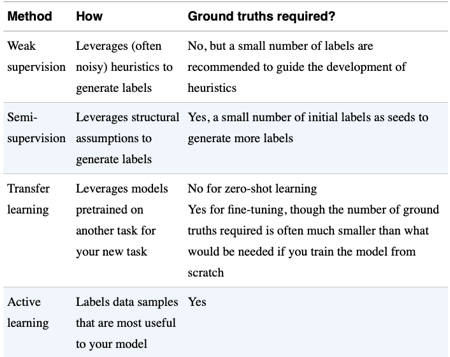

# 4 - Training Data
This chapter covers different techniques for **creating good training data.**
- Sampling techniques to select data for training
- How to tackle common challenges with training data:
	- Labelling problems
	- Class imbalance problems
	- Lack of data problems and data augmentation

Creating training data is an iterative process. As your model evolves through a project lifecycle, your training data will likely also evolve. 

# Sampling
Sampling happens in different steps of the workflow. For example:
1. Sample from all possible real-world data to create good training data.
2. Sampling from a given dataset to create coherent train, test and validation splits.
3. Sampling from all possible events that flow though you ML system for monitoring purposes.

## Non-probability Sampling
Non-probability sampling is a bad idea. The samples selected are not representative of the real-world data and therefore are riddled with selection biases. This will result in your ML models performing poorly and being unfair.

We describe some of the common non-probability sampling methods used so that you can identify them and avoid them.

### Convenience Sampling
Samples of data are selected based on their availability. This sampling method is popular because, well, it’s convenient. 

### Snowball Sampling
Future samples are selected based on existing samples. For example,  incrementally scrape twitter accounts by starting with a set of seed accounts and scraping who they follow. 

### Judgement Sampling
Experts decide what samples to include.

### Quota Sampling
Select samples based on quotas for certain slices of data without any randomisation. For example, force 100 responses from each of the age groups: under 30 years old, between 30 and 60 years old, and above 60 years old, regardless of the actual age distribution. 


## Probabilistic Sampling
Probabilistic sampling is a good idea. The specific type of sampling to use depends on your use case.

### Simple random sampling
Select `p%` of your population by giving each sample a `p%` chance of being selected.
- **Pros:** 
	- Very simple to implement.
	- Sampled data follows the distribution of the population.
- **Cons:** 
	- Rare classes have a high chance of being left out. Models trained on this sampled data may think that the rare classes do not exist.


### Stratified sampling
Divide the population into the groups you care about *and then* sample each group giving each entry a `p%` chance of being selected.
- **Pros:**
	- No matter how rare a label is, you ensure samples from it will be included in the selection.
- **Cons:**
	- Cannot be used if samples cannot be cleanly separated into groups. For example, in multi-label tasks. 


### Weighted sampling
Give each sample a different probability of getting selected. For example, all elements with label `A` have 50% chance, `B` have 30% chance and `C` have 20%.

In python you can use `weights` in `random.choice`
```python
import random 
random.choices(
	population=[1, 2, 3, 4, 100, 1000],
	weights=[0.2, 0.2, 0.2, 0.2, 0.1, 0.1],
	k=2
) 
```

- **Pros:**
	- Can be used to incorporate **domain knowledge** into the ML system. For example, if you know more recent data is more valuable, give it more weight.
	- Can be used to **rectify incorrect distributions in the available data and make the sampled data match the real world distribution**. For example, let's say that your available data has 75% female and 25% male labels. However,  you know that the real wold distribution is 50/50%. To fix that you would use weighted sampling to rectify the distribution by giving more weight to male examples.
- **Cons:**
	- If not used carefully you can end up baking in biases into your data.
- **Note that:**
	- **Weighted sampling** is not the same as **sample weighting.** Sample weights are used during training to make certain samples affect the  algorithm's **loss function** more than others. Giving higher training weights to samples that are close to the decision boundary can help your algorithm learn the decision boundary better. 
	- #todo : how is weighted sampling related to [Class Imbalance](#Class%20Imbalance)?


### Reservoir sampling for sampling streams
Creating a continuous sampled dataset from stream of data has these challenges:
- You don't know the size of the population beforehand. However, following good practices, you probably want every sample in the dataset to have the same probability of being selected.
- You can't keep adding new samples to the sample dataset forever. At some point you will run out of memory.
- You must be able to stop the continuous sampling at any point in time and each element in the dataset must have been sampled with the correct probability.

The **reservoir sampling algorithm** allows you to continuously sample a dataset of `k` elements while overcoming the challenges above. `k` is limited by the amount of memory you have.

1. Put the first `k` elements into the reservoir. 
2. For each incoming `nth` element, generate a random number `i` such that `1 ≤ i ≤ n`. 
3. If `1 ≤ i ≤ k`: replace the `ith` element in the reservoir with the `nth` element. Else, do nothing. 


# Labelling
Good labelling is a critical part. Some companies even have in-house labelling teams (e.g. Tesla). 

Hand labelling is full of problems, many of which have no good solution. If your problem allows, circumvent these problems by either using [Natural labels](#Natural%20labels) or the techniques described in [Handling the Lack of Labels](#Handling%20the%20Lack%20of%20Labels) .

## Hand labels
- **Problem 1: Hand labelling is expensive**. Especially when you need subject matter experts to produce the labels (like medical Doctors classifying X-rays).
- **Problem 2: Hand labelling poses a threat to data privacy.** Someone will need to have access to non aggregated  data. This makes it harder to outsource labelling and adds a security assurance burden.
- **Problem 3: Hand labelling is slow.** Slow labelling leads to slow iteration speeds, which in turn makes your models less adaptive to changing environments. The longer the labelling process takes, the more you existing model performance will degrade.
- **Problem 4: Label multiplicity**: Having different annotators label data from different data sources can lead to label ambiguity. 
	- Disagreements between annotators are extremely common.
	- The higher the level of domain expertise required, the higher de potential for disagreements.
	- **Partial Solution:** The best way to minimise this is to put great care in providing annotators with a clear problem definition and instructions.
- **Problem 5: Data lineage tends to be forgotten:** For example, you train a good model using 100K samples with good labelling quality.  Then you outsource another 1M samples for labelling. Unfortunately, the quality of the outsourced labels is poor (but you don't know it). Then you mix the data and train the same model with 1.1M samples. Finally you discover that your model performance has decreased as a consequence of the poor labelling. To make things worse, you cannot recover from it because you have mixed the data.
	- **Solution:** Use *data lineage* practices. Keep track of the origin of each of your data samples as well as the origin of their labels. Tracking this can help you debug data problems.

## Natural labels
Some problems have **natural ground  truth labels** that can be automatically derived **or approximated** by the system.  
- Some problems have stronger natural labels than others. 
- Label approximation can either be done using **explicit** or **implicit**  labelling. Explicit labelling means that we ask the user to give us the label in some way.
- Examples of strong natural labels: 
	- ETA in google maps can be verified with the actual trip time. 
	- Stock price prediction can be verified. 
- Examples of weaker natural labels (usually need to be approximated):
	- Recommender systems typically allow for natural labels to be *approximated* by recording if a suggestion was taken (positive label) or if wasn't taken within a defined time window (implicit negative label).
	- In Newsfeed ranking problems, natural labels can be *approximated* by adding a like and dislike button. This is a case of explicit approximation.
- Companies tend to choose working on problems with natural labels while they are getting started with ML because they tend to be easier and cheaper problems to work on.

### Feedback loop length
In problems that have natural labels, the feedback loop is the time from when a prediction is offered to when we are able to derive or approximate the ground-truth label of that sample.
- If ground-truth labels is available within minutes, this is considered a short feedback loop. 
- Problems with shorter feedback loops are easier to work with and produce systems that adapt better to changing requirements and data distributions.
	- This is true for all problems. If you can get labels faster, your life will be easier.

#### Problems that have strong labels
When dealing with problems that have strong natural labels, the length of this loop is usually determined by the nature of the problem. For example:
- Stock predictions can be verified within minutes.
- Google maps' ETA predictions can be verified in the order of hours.
- Fraud detection has a long natural feedback loop because the dispute process fully terminates months after a transaction is issued.

#### Problems that need label approximation
Trying to approximate a label typically brings some trade-off decisions to make.

##### Choosing the type of user feedback for approximation
You can use different signals at different points of a user journey to approximate a label.  Different signals have different **volume, strength and loop length.**

For example in a product recommendation system you can use *"clicked on the product"* to generate a label. Alternatively you can use the *"bought the product"* signal. Clicks will happen more often (i.e. more data) and have a tighter feedback loop, but purchases are a much more valuable signal.

There is no right decision here. You need to weight the tradeoffs and make a call.

## Handling the Lack of Labels
This section covers 4 categories of techniques that have been developed to deal with the challenges of getting sufficient high-quality labels. You may use one or several of them at the same time.

Overview:


##### Choosing the time window for implicit approximation
Problems in which we need to implicitly infer a label because something *didn't happen* are very common. In these  we usually need to choose a **time window** after which the negative label is assigned (e.g. User didn't watch the recommended movie).
- Shorter time windows  = Shorter feedback loops + Higher mislabelling because the target action happened after the arbitrary time window limit.


### Weak Supervision Labelling

This youtube video explains several arrangements for weak supervision, including some iterative arrangements that are very interesting.
https://www.youtube.com/watch?v=SS9fvo8mR9Y


**The TL/DR of it is:**

The idea of weak supervision is motivated by the assumption that systems trained using a lot of data tend to perform better than models with a small but perfect dataset; even if the labels you use for training are somewhat noisy. This is especially true if your model is a re-train or a fine-tune of some pre-trained model, like a previous iteration of the same model or doing transfer learning model (like a language model). 

The high level steps are:
1.You (or a subject matter expert) develop a set of heuristics to label data automatically using some simplifications. You wrap each of those heuristics inside a `labelling_function` (LF). Different heuristics might contradict each other and some might be better at labelling certain samples than others. All of this is ok.
```python
def labelling_function(example_note):
  if "pneumonia" in example_note:
	return true
```
- Some types labelling functions:
	- Keyword heuristics: is a keyword in the sample?
	- Regular expressions: does the sample match a regex?
	- Database lookup: does the string contain a string that matches the list of dangerous diseases?
	- Outputs from previously trained models. They can either be simple models trained on some small set of hand-labelled data or the output of a previous iteration of a model.
2. You apply the set of labelling functions to the data you want to label.
3. A tool like [Snorkel](https://github.com/snorkel-team/snorkel) will be able to take in all the different "label votes" produced by the labelling functions, learn the correlations between the them and output a probability vector of the label (e.g. [80% black, 10% green, 10%white]). Essential what Snorkel is doing is combining, de-noising and re-weightings the votes from  all LFs to obtain **the label likelihoods.** 
4. You would then train your big model using the output probability vectors.

- **Pros:**
	- **No hand labels required:** In theory you don't need hand labels for weak supervision. However having a small sample of hand labels if recommended to check the accuracy of your LFs.
	- **Privacy:** Weak supervision is very useful when your data has strict privacy requirements. You only need to see a few samples to create an LF, the rest can be done automatically.
	- **Speed:** Labelling lots of data with LFs is very fast (when compared to hand labelling)
	- **Adaptability:** when changes happen, you can just change your LF and reapply it on all of your data.  If you were hand labelling, you would need a full re-label. 
	- LFs allow you to incorporate subject matter expertise and to **version it, reuse it and share it.**
- **Cons:**
	**- Too Noisy labels:** Sometimes labels can be too noisy to be useful. To make things worse, unless you have some small set of hand labelled data, you won't know how bad the noisy labels are.


### Semi-Supervision
Conceptually, semi-supervision is using an initial set of labels as a seed for labelling more unlabelled data using some sort of method.

Here are 3 examples of semi-supervision implementations:

1. **Self-training**: use the seed of labelled data to train a model > use that model to produce labels for some unlabelled data > add samples with high raw probability to the training set > rinse and repeat until you are happy with your model's performance.
3. **Labelling by clustering:** assume that the unlabelled data points that cluster close to labelled data points share the same label.
4. **Perturbation:** It assumes that small perturbations to a sample shouldn't change its label. So you apply small perturbations to your training instances to generate new training instances. This can also be considered as a form of [Data Augmentation](#Perturbation).

### Transfer learning
A model developed for a task is reused as a starting point for a model a model on a second task. The first task usually has cheap and abundant training data.  
- Transfer learning is based on the idea that large neural models tend to be very robust against changes in task. For example, a language model for the English language trained on Wikipedia will be useful even if your NLP task has nothing to do with Wikipedia. 
- Language models built on large corpuses are a typical examples of transfer learning (e.g. BERT).
- Fine tuning the base model for your task can mean making small changes to the base model, such as continuing to train all or part of the model with your own data for your own task.
- Transfer learning has gotten a lot of interest because it allows you to use for free models that could have cost tens of millions of dollars to train.
- Usually the larger the pre-trained base model, the better its performance on downstream tasks.

### Active learning
Active learning is based on the idea that there are some samples that are more valuable to label than others. For example, samples that are closer to the decision boundary are more valuable because they will allow your model to learn the boundary better.

In active learning, your model will automatically tell you which samples you should go and label. Some examples of active learning implementations are:
1. You apply your model to a set of unlabelled data and your model selects the samples with less certainty (e.g less raw probability) to be labelled and added to the training data.
2. You apply ensemble of models to a set of unlabelled data and select the samples with less consensus for labelling.  The ensemble can be made of models trained on different slices of data, or with different hyper-parameters, or different models altogether. 
3. Some active learning techniques allow your models to synthesise samples that are in the region of uncertainty. 
4. Some companies apply active learning with the data being evaluated in production. If a model running in prod is not very certain about a sample it just saw, the sample is flagged for labelling.

# Class Imbalance
- **Class imbalance in classification tasks** happens when there is a substantial difference in the number of samples in each class of the training data.
- **Class imbalance in regression tasks** - An example: for the task of estimating the cost of a hospital bill, most of the data collected falls between in the  $100 to $1000 range and you have very little data for astronomical bills above $10K. If you do nothing, your model will tend to fit the range with more data better, even if it is at the cost of being very wrong in the high bill range.

## Causes of Class Imbalance
1. **Naturally imbalanced problems:** problems that are naturally heavily imbalanced are very common in the real world (e.g. cancer detection, fraud detection, any anomaly detection problem). To make things harder, in many of these problems predicting the minority classes correctly is **far more important** than predicting the majority ones (e.g. in cancer detection). This is the most common cause of class imbalance.
2. **Imbalance caused by biased sampling:** your problem may not naturally be heavily imbalanced, but the way you sample your data may make your data **look**  imbalanced. For example, imagine you want to build a model that identifies if a Tweet is SPAM. If you scrape public Twitter to build a homemade dataset you may find that only a very small percentage of Tweets are SPAM. This might not be the real distribution. Tour data **looks**  imbalanced because most SPAM tweets are taken down by Twitter's own algorithms before making them public. The section on [Sampling](#Sampling) has more info on how to avoid sampling pitfalls.
3. **Imbalance caused labelling error:** annotators might read the instructions wrong and use one class far less than the others. This is the least common cause.

## Why is Class Imbalance a Problem?
If you don't do any tweaking, ML algorithms don't work as well in **heavily** imbalanced datasets as they do in balanced ones. Why?
1. Your algorithms may have insufficient signal to learn the parameters that work for minority classes. Training on minority classes becomes a few-shot learning problem.
2. Your algorithms can get stuck during training in non-optimal solutions that exploit simple heuristics like always returning the majority class. 
3. The default behaviour of an ML algorithm is to treat a misclassification of any class equally with no way to encode class importance during training. This is problematic for tasks where the misclassification of a minority class can have catastrophic consequences (e.g. cancer diagnosis in chest x-rays).

Some tasks are more sensitive to class imbalance than others. In general, the more complex the model, the more sensitive it is to imbalance. The opposite is also true, simple linearly separable problems are not sensitive to class imbalance. 

## Handling class imbalance
Some might argue that you shouldn’t try to “fix” class imbalance if that’s how the data looks in the real world. They argue that a model should learn to handle that imbalance. However, developing a model that does a good job under these conditions can be challenging, **so we still have to rely on special training techniques**.

There are 3 high-level approaches to deal with class imbalance: (1) choosing the right metrics, (2) data-level methods and (3) algorithm-level methods.

### Choosing the right metrics
Using metrics that treat all classes equally is a bad idea when you have class imbalance because the metrics will be driven by the majority classes. This is especially bad when the majority class is not the class you care about. A typical case of a bad metric is using **overall** accuracy; for example, a CANCER detecting model capable of classifying 90% of the x-rays correctly tells us very little about its CANCER detecting capabilities, since most of the samples are NON-CANCER.

A solution to this is to use class-specific metrics targeted on the class we care about.  *Precision*, *recall* and *F1* are all class-specific metrics you can use.

#### Thresholding 
If the output of your classification model is continuous variable, like a probability, you can use a **threshold** to choose the precision and recall for your algorithm. This selection is actually informed by how much we care about the important class and how tolerant we can be with misclassifications of other classes.

The two common tools used for this threshold selection are **ROC curves** and **precision-recall curves.**

\* Note that you can easily frame a classification problem as a regression problem to enable the use of thresholds. 

### Data-level methods: resampling
Data-level methods modify the original distribution of the data to reduce the imbalance. *Resampling* is the most common family of techniques used for this. It includes *oversampling* (adding instances from the minority class) and *undersampling* (removing instances from the majority class).

- **Random undersampling:** randomly remove instances from the majority class until you achieve the desired balance.
- **Random oversampling:** randomly make copies of the minority class until you get a ratio you are happy with.
- **Tomek links:** a technique for undersampling *low dimensional* data. Find pairs of datapoints with different class that are close to each other and remove the sample from the majority class.
	- It helps the algorithm learn  a clearer decision boundary.
	- It makes the model less robust as it doesn't get to learn the nuances in the decision boundary.
- **Synthetic minority oversampling technique (SMOTE):** create new minority class samples by doing convex (~linear) combinations of minority class samples.
-  **Tomek Links**, **SMOTE** and more fancy resampling techniques tend to be effective only in low-dimensional data. The techniques that rely on distance calculations get expensive to compute with higher dimensions.

#### Resampling risks
- **Never evaluate your model on resampled data**. Despite training it with a modified data distribution, you want to evaluate your model with data that follows the real distribution to get an idea of its  true performance.
- Undersampling has the risk of throwing away important data.
- Oversampling has the risk of promoting overfitting to the data. This is especially true if the oversampled samples are copies.

#### Techniques to mitigate these risks
- **Two-phase learning:** First train your model on undersampled balanced data. Then fine-tune the training using the original data.
- **Dynamic Sampling:** oversample the low-performing classes and under-sample the high performing ones. This aims to show the model less of what it already knows and more of what it needs to learn better.

### Algorithm-level methods
Intuition: the loss function guides the learning process. We can modify the loss function to help the model deal with imbalance automatically during training.

#### Cost-sensitive learning
Define a cost matrix where each entry `Cij` is the cost of class `i` getting classified as class `j`. If `i=j` the classification is correct and a 0 cost is usually used. Since learning looks for loss minimisation, the training process will put more emphasis in the misclassification of more expensive classes.

This framing allows you to naturally incorporate domain knowledge like *"it is 20 times more costly to misclassify CANCER as NORMAL than the other way around"*. 

#### Class-balanced loss
This is similar to cost-sensitive loss, but the weight (or cost) of misclassification is determined by the number of samples in each class.

In it's vanilla form,  `Wi` (the weight for class `i`) is `1/N_samples_of_class_i`.  A more sophisticated approach can take into account overlap between existing samples an base the calculation on *effective number of samples.*

#### Focal loss
Intuition: Incentivise the model to focus on samples that it is still having trouble calculating by giving more weight to samples whose probability of classification in the correct class is lower. See the book for the focal loss equation.


# Data Augmentation
Data augmentation is a family of techniques used to increase the amount of training data. Augmented data is often useful in making our models more robust against noise and adversarial attacks*.

\* An **adversarial attack** is when someone crafts a production sample to trick an ML model into misclassifying something. For example, changing a few pixels in an image to get the image classified differently. Neural networks are particularly sensitive to noise.

Data augmentation is standard in computer vision tasks and is becoming popular in NLP tasks. There are three main types of data augmentation: (1) simple label-preserving transformations, (2) perturbation , and (3) data synthesis. In each type, we’ll go over examples for both computer vision and NLP. 

## Simple label-preserving transformations
- **In computer vision:** randomly modify an image preserving its label. Think rotation, cropping, flipping, inverting, erasing part of an image. 
- **In NLP:** replace a word in a sentence with a similar word that does not change the meaning of the sentence. You can select "similar" by using a synonym dictionary, a word net or another word that has a similar word embedding.


## Perturbation
- **In computer vision:** Noisy samples can be created by either adding **random noise** or by a **search strategy** like Adversarial Augmentation. In Adversarial Augmentation, an algorithm finds the least number of changes it needs to do to a sample to change the label. You would then add that altered sample to your training data to make your model more robust.
- **In NLP:** perturbation is less common in NLP because changing a word or adding noise will likely change the meaning of the sentence. 

Perturbation can also be used in the [Semi-Supervision](#Semi-Supervision) context and the [offline evaluation contexts](06-model-development-and-offline-evaluation.md#Evaluating%20robustness%20with%20perturbation%20tests).

## Data synthesis
- **In computer vision** a common technique is to generate new images by combining two images with different labels. This is called a *mixup*. For example if the DOG label is 0 and the CAT label is 1, you could create a mixup image that is half and half and whose label is 0.5.
- **In NLP** string templates area a great and cheap way to generate lots of data. For example,  using the template *"Find me a \[CUISINE\] restaurant within \[NUMBER\] miles of \[LOCATION\]"* , plus  a database of CUISINES and some sensible parameter for NUMBER and LOCATION, you can generate thousands of samples.
- Using Neural Networks to synthesise data is an exciting research area at the moment, but it is not popular in production yet.