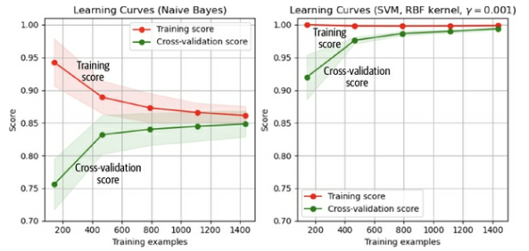
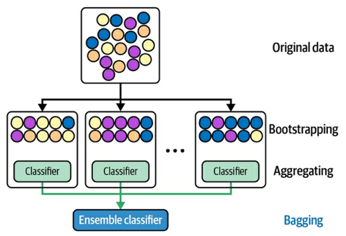
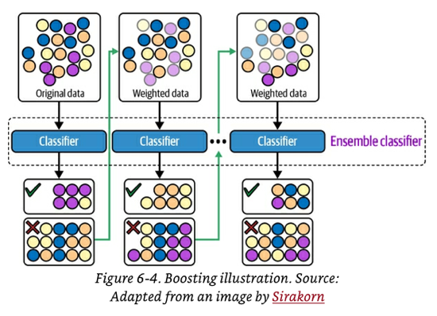
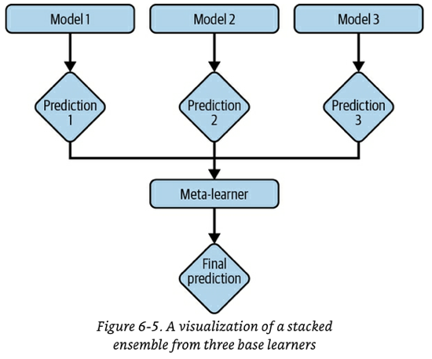
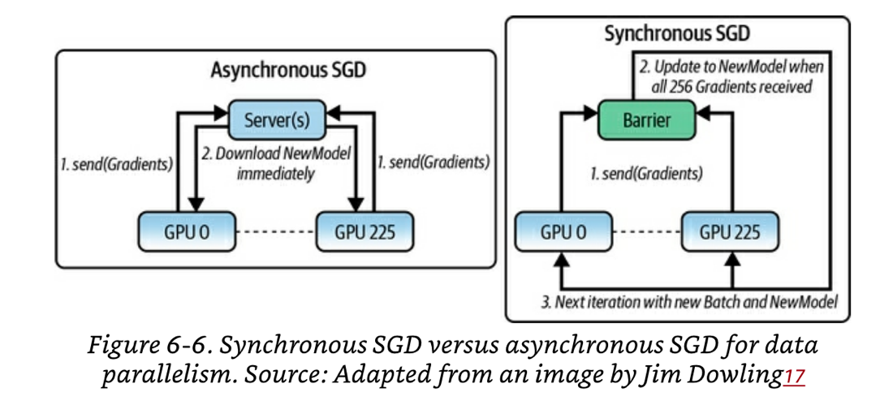
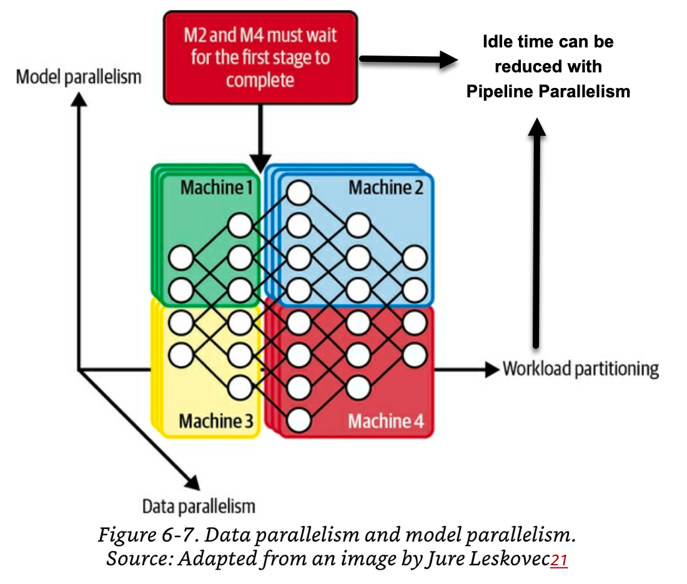
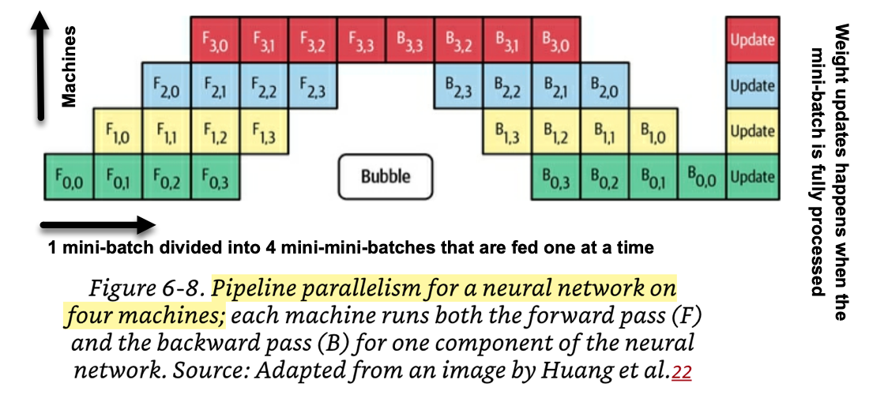

# 6 - Model Development and Offline Evaluation

With an **initial** set of training features, model development can finally begin.  Keep in mind that feature engineering and model development are an iterative process.

This chapter will cover:
- Model selection, development and training
	- Criteria to select ML models
	- Ensembles as part of model selection
	- Experiment tracking and versioning during model development.
	- Debugging ML models
	- Modes of Distributed training: data parallelism, model parallelism and pipeline parallelism.
	- AutoML: automatic hyperparameter tuning, auto architecture search and learned optimizers.
- Offline evaluation: How to evaluate your model alternatives to pick the best one
	- Baselines: you need to compare your model against something.
	- Offline evaluation methods beyond overall ML metrics:  Evaluating your models for robustness, fairness, and sanity before picking one and sending it to production.

## Model Selection, Development and Training
### Criteria to select ML models
There are many aspects you need to balance out when making a model selection decision. Model selection is an art more than a science. This chapter should give you some guidelines and tips on what to consider.

#### Tip 1: The right tool for the right job
Narrow the search space of model selection by focusing only on the models that are suitable for the problem at hand. For example:
- If you want to build a fraud detection system, you should know this is a classic anomaly detection problem and that common models used for this category of problems are KNNs, isolation forest, clustering and neural networks.
- If you are tasked with an NLP text classification problem your options typically are naive-Bayes, logistic regressions, recurrent neural networks and transformer-based models such as BERT or GPT.

#### Tip 2: Be aware of your team's "maturity phase" for the problem type you are facing

There are 4 phases of ML adoption for a given problem. The solution for one phase can be used as the baseline to evaluate the solution for the next phase:

- **Phase 1: Pre-ML** : This is your first time solving this type of problem. Your first stab at the problem can be a simple heuristic like recommending "most popular" or ordering by chronological order. You may even find that a non-ML solution is all you need.
- **Phase 2: Simplest ML models:** This will be your first ML model for this problem.  See [Tip 6: Start with the simplest model](#Tip%206:%20Start%20with%20the%20simplest%20model).
- **Phase 3: Optimizing simple models:** Make your simple model better by optimising objective functions, hyper-paramenters search, feature engineering adding more data, creating ensembles, etc.
- **Phase 4: Complex models:** Move to complex models once you have reached the limits of your simple models. In this phase you also want to figure out how your model decays (e.g. how often retraining is needed) so that you build retraining pipelines.

#### Tip 3: Consider model properties beyond training metrics
Direct training-related performance metrics like accuracy, F1, log loss are typically used for model selection. However, these should not be only metrics to consider.  

You should also care about other properties like amount of data needed, computational needs of the model, time to train, inference latency and model interpretability.  

The set of metrics you select to make your decision varies depending on your problem. For example, some in some use cases latency is critical even if it means sacrificing a bit of accuracy.

#### Tip 4: Avoid the state-of-the-art trap
Models with "state-of-the-art"  performance  usually come directly from research. However researchers often only evaluate their models in academic settings using existing pre-defined datasets.

The fact that a model has state-of-the-art performance in research does not mean that the model will be fast enough, or cheap enough for *you* to implement. Similarly it doesn't mean it will have the same performance on *your data*.

If there’s a solution that can solve your problem that is much cheaper and simpler than state-of-the-art models, use the simpler solution.

#### Tip 5: Avoid the "classic ML is dead" trap
Neural networks receive a lot of press these days. However, that doesn't mean that classical ML models are going away. Classical models are still vastly used in production, especially when latency or explainability are important.  

Additionally, it is not rare to see classical and neural models deployed in tandem.  For example:
- Ensemble arrangements using neural models and decision trees.
- A classical model like k-means can be used to extract features that become input to a NN.
- Pre-trained neural networks like BERT of GPT-3 are used to generate embeddings that are fed to classical models like a logistic regression.

Don't discard classical models just because the are not "neural networks".

#### Tip 6: Start with the simplest model
- Simple models allow you to validate your framing and your data early.
- Simpler models are easier to deploy. Deploying your model early allows you to validate things like: 
	- End-to-end behaviour of your feature
	- Consistency between your prediction and training pipelines
	- Your system's ability to detect [natural labels](04-training-data.md#natural-labels) (if your problem has any)
	- Your system's ability to detect data distribution shifts and re-training triggers
- Starting simple and adding more complex components slowly makes it easier to understand and debug models.
- Simple models become a baseline to compare complex models against.
- Simple models and low-effort models are different things.  Using a pre-trained BERT model is low-effort (because the work is done for you), but the model is not simple. 
	- Some times it makes sense to start with low-effort  & complex models instead of simple models. However, even in those cases having a simple model as a baseline is valuable because improving upon a complex model is very challenging. 

#### Tip 7: Avoid human biases in selecting models
**Make sure you give different architectures a similar treatment before selecting:** An engineer that is excited about a particular architecture will spend more time experimenting with it. As a result it is likely that he finds better performance in that architecture compared to the architectures they are less excited about.

#### Tip 8: Evaluate good performance now VS good performance later
- The best model now does not mean that that will be the best model two months from now. E.g. If you have little data now, a decision tree might work best now. In two months, when you have more data, a NN can maybe work better.
- Model's performance tends to saturate as you feed the model more data. Simple models saturate faster than complex ones. You can use **learning curves** to assess if your model has learned as much as it can (i.e. has saturated) or if it still has the potential to improve in the near future. 
	- If the model has saturated , perhaps trying a more complex model is in order.

- Some teams deploy simple models (good performance now) and complex models (good performance later) in a champion-challenger arrangement.  They keep training the complex model as more data becomes available and swap them when the complex model is performing better.
- When doing model selection, you might want to take into account potential for improvements in the near future and difficulty to achieve those improvements in your decision making.

#### Tip 9: Evaluate trade-offs
Model selection is filled of trade-offs. Understanding what is important for your particular use-case will help you make a an informed decision. Some common tradeoffs are:
- **False positives VS false negatives trade-off**. E.g. If your model is diagnosing a dangerous diseases, you may prefer a model that minimises false negatives.
- **Compute intensity VS performance trade-off**: bigger and more complex models may be more accurate, but they may require more powerful machines and specialised hardware to run them.
- **Latency VS performance trade-off**: bigger and more complex models may be more accurate, but they will be slower in producing an inference. Some use cases have tight latency requirements.
- **Interpretability VS performance trade-off**: as model complexity grows, performance tends to improve but interpretability of the model decreases.

#### Tip 10: Understand your model's assumptions
All ML models have some baked-in assumptions. Understanding those assumptions and investigating if your data satisfies those assumptions can guide you in model selection.

A sample of some common assumptions made by models:
- **Prediction assumption:** Models assume that predicting Y from X is actually possible. Sometimes data is just random and there is no pattern to learn.
- **Independent and Identically distributes (IID)**: lots of models (including neural networks) assume that all examples are IID.
- **Smoothness:** all supervised ML models assumes that there is a **smooth** function that can be learned to transform inputs X into an inference Y. That means that inputs that are very similar X and X', should produce outputs that are proportionally close.
- **Tractability:** Let X be the input and Z be the latent representation of X. Generative models assume that it is tractable to compute P(Z|X).
- **Boundaries:** linear methods assume that decision boundaries are linear. Kernel methods assume that the decision boundaries follow the shape of the kernes used.
- **Conditional independence:** models based on naive-Bayes classifiers assume feature values are independent of each other given the class.
- **Normally distributed:** Many models assume that data is normally distributed.

### Ensembles
Using an ensemble is a a method that has consistently demonstrated performance boosts over single models. In an ensemble, multiple *base learners* are trained and each of them outputs a prediction. The final prediction is derived using a heuristic like majority vote.
- 20/22 winning solutions on 2021 Kaggle competitions used ensembles. The top 20 solutions of [SQuAD 2.0](https://rajpurkar.github.io/SQuAD-explorer/) are ensembles.

Ensembling methods are **less favoured in production** because they are harder to deploy and maintain. However, **they are still common in tasks where a small performance boost can lead to a huge financial gain.**

When creating an ensemble, the **less correlation there is among base learners, the better the ensemble will be.** Therefore, it’s common to choose **very different types of models for an ensemble**. For example, you might create an ensemble that consists of one transformer model, one recurrent neural network, and one gradient-boosted tree.
- It is also common to use odd number of *base learners* to avoid ties in voting.

There are 3 ways to create an ensemble: **bagging, boosting** and **stacking**.  These techniques can even be combined.

You can find great advice on how  to create an ensemble in MLWave's (legendary Kaggle team) [ensemble guide](https://github.com/MLWave/Kaggle-Ensemble-Guide).

#### Bagging
- Bagging has many **benefits**: improve training stability, improve accuracy, reduce variance and help to avoid overfitting.
- **Intuition**: Sample with replacement to create different datasets. Train a classification or regression model on each dataset.
	- Sampling with replacement ensures that each bootstrap is created independently from its peers (i.e. less correlation between base learners).
- When to use: improve stability on unstable methods (e.g. NNs, classification and regression trees, linear regression)
	- It can mildly degrade performance in stable methods like k-nearest neighbours.

#### Boosting
- **Intuition:**
	- 1. Start by training the first weak classifier on the original dataset.
	- 2. Samples are re-weighted based on how well the first model classifies them. Misclassified examples have higher weights. 
	- 3. Train a second classifier with the re-weighted samples.
	- 4. Samples a re-weighted again based on the output of classifier 2.
	- 5. Third classifier is trained using the re-weighted samples from classifier 2.
	- 6. Repeat for as many iterations as you need.
	- 7. Form the final strong classifier as a weighted combination of all the existing classifiers. Classifiers with smaller training errors have higher weights.
- **Boosted algorithms**: 
	- Gradient Boosted Machines (GBMs)
	- XGBoost: the algorithm of choice for many ML competitions.
	- LightGBM: an alternative to XGBoost that allows distributed parallel training (good for large datasets).

#### Stacking
**Intuition:** train different base learners (typically each very different in nature to the other). To produce the final prediction use a **meta-learner** whose job is to learn how to combine the predictions from the base-learners. 
- The meta-learners can be simple heuristics like majority vote (classification) or average (regression).
- Or they can be another (typically simpler) model like a logistic regression (classification) or linear regression model.
- #todo : Is it common to also give the meta-learner access to the features so that it can learn what types of samples each meta-learner is good at?

### Experiment tracking and versioning
Keeping track of the configuration parameters that constitute an experiment and of the artefacts that experiment produces is a key for doing **model selection** and for **understanding how changes to the experiment parameters (data, parameters, model) affect the performance of your output model.** 

**Experiment tracking** and **versioning** are 2 different concepts that go hand in hand with each other and are usually spoken about as a single thing.
- Experiment tracking: process of tracking **progress** and a **the results** of an experiment.
- Versioning: the process of logging all the **configuration parameters** of an experiment to be able to replicate it.
- Many tools that were originally crated for experiment tracking now include versioning (e.g. MLFlow and Weights & Biases) and vice versa (e.g. DVC). 

Keep in mind that aggressive experiment tracking and versioning helps with reproducibility but does NOT ENSURE IT. 

#### Experiment tracking
- Experiment tracking allows ML engineers to effectively babysit the training process; this is very big part of the training. 
- Some examples of things you may want to track are:
	- **Loss curve** of train and each of the eval splits.
	- **Model performance metrics** you care about on all non-test splits: accuracy, F1, perplexity.
	- A **log of <sample, ground truth, prediction>**. This is useful if you need to do manual analysis for a sanity check.
	- **Speed of your model** evaluated by the number of steps per second. If dealing with text-based models, number of tokens processes per second.
	- **System performance metrics**: memory usage, CPU/GPU usage. Helps to identify bottlenecks and avoid wasting resources.
	- **Values over time of any parameter and hyper-parameter** whose changes affect model performance. e.g. learning rate, gradient norms (global and per layer), weight norm.
- In theory, it is not a bad idea to track everything you can. In practice, if you track everything you will get overwhelmed and distracted by the noise.

#### Versioning
- ML systems are part code, part data. You need to version **both.**
- Versioning data is the hard part for these reasons:
	- Data is much larger than code, so we can't reuse the code versioning tools. Duplicating a dataset several times to be able to roll back to a previous version is unfeasable. 
	- There is still confusion on what exactly constitutes a `diff` when versioning data
		- Do we track every change OR should we track only the checksum?
		- As of 2021, tools like DVC only register checksums of the total directory.
	- It is not clear what merge conflicts are in versioned data.
	- If you use user data that is subject to GDPR or similar regulations, complying with data deletion requests becomes impossible.

### Debugging ML Models
Debugging ML models is hard and frustrating for several reasons:
- ML models fail silently. They still make predictions but the predictions are wrong. Sometimes you just don't know that your model has a bug.
- Validating if a bug was fixed is frustratingly slow. You may need to re-train the model and then re-evaluate the sample with the new model. Sometimes you just have to wait to deploy to production to be able to tell.
- ML models have many points of failure that may be by different teams: data, labels, features, ML algorithm, code, infra, etc.

Unfortunately, there is no scientific approach to debugging ML. However there are some tried and true techniques that are generally regarded as good practices.
- **Start simple and gradually add more components:** by doing this you are able to see if what you are doing helps or hurts performance. This also allows you to get some intuition on the behaviour to expect. 
	- Cloning an open source state-of-the-art implementation and plugging in your own data is an anti-pattern. There is very little change that it will work and if it does't it is very hard to debug.
- **Overfit a single batch:** After you have a simple implementation of your model, try to overfit a small batch of data and then run the evaluation on that same data to make sure it gets a very high accuracy (or the smallest loss) possible. If you can't get a very high accuracy on a small overfitted batch, there might be something wrong.
- **Set a random seed:** ML models have many places that use randomness. Randomness makes it hard to compare and reproduce experiments as you don't know if the changes in performance are due to the randomness or due to your changes. Using a consistent random seed across experiments helps keeps things comparable.
- See more techniques in Adrej Karpathy's post ["A Recipe for Training Neural Networks"](http://karpathy.github.io/2019/04/25/recipe/)

### Distributed Training
It is common to train models with data that does not fit into memory. When this happens, your algorithms for preprocessing (e.g. normalizing), shuffling  batching and training will need to happen in different machines and in parallel.

As an ML engineer, getting experience with distributed training and ML scaling is hard because it requires access to large amounts of resources.

Next we will cover some modes of distributed training.

#### Data parallelism
Intuition:  split your data on multiple machines, train your model on all of them, and accumulate gradients.

This is the most common parallelization method but it has a couple of issues.

##### Issue 1: sync vs async gradient descent

When your data is very large (e.g 100B samples), you won't be able to process your entire training set and accumulate the gradients even if you split the entire training set into multiple machines (e.g. 10 machines, means 10B samples per machine, this is is still unfeasible).

Similar to what happens in the non-parallel case,  you will need to use **mini-batches**. Different to the non-parallel case, in parallel training you will split the **mini-batch** further into the number of available machines and have each machine process a **mini-mini-batch**.  

The issue happens when you need to decide how to **update the weights and biases** after a machine is done processing a **mini-mini-batch**.

- **Synchronous stochastic gradient descent** (sync-SGD):  This approach waits for all machines to finish processing their respective mini-mini-batches before accumulating gradients. A main node then accumulates the gradients and updates the weights.  All assisting nodes download the new model weights from the main once it is done and start processing the next mini-batch. 
	- Pros: converges faster
	- Cons: One slow assisting machine will cause all the system to slow down. The more machines, the more likelihood that one will be slow. There are algorithms that address this problem.
- **Asynchronous stochastic gradient descent (async-SGD)**:  machines send their gradients to the main node as soon as they finish processing their mini-mini-batch. The main node immediately updates the weights without waiting for other assisting nodes. assisting nodes download the updated version of the model immediately and they get to work on the next mini-mini-batch.
	- Pros: no system slowdown due to slow nodes.
	- Cons: in theory needs more steps to converge due to gradient staleness.
		- In practice,  if gradient updates are sparse, there is little difference in the convergence speed between sync and async SGD.

##### Issue 2: Large number of assisting nodes = large batch sizes
If you have access to say 100 assisting GPU nodes and each can process a mini-mini-batch of 10,000 samples, then the mini-batch size would be 1M. Larger mini-batches typically cause models to train faster because GPUs are not very sensitive to number of samples (i.e. you can 2X the number of samples and the computation time won't 2X). 

The usual rule of thumb *in theory* is that if you 2X the mini-batch size you should also ~2X the learning rate. However, *in practice*: 
- Increasing the learning rate too much may cause unstable convergence
- Increasing the batch size past certain point brings diminishing returns
- Increasing the batch size while keeping your learning rate a number of epochs constant can result in lower accuracy
- The selection of the batch size and learning rate hyper parameters is an art more than a science. [Weights and biases has a great video that goes over the intuition of learning-rate vs batch size](https://www.youtube.com/watch?v=ZBVwnoVIvZk)

Don't fall into the trap of losing sight of the mini-batch size or using gigantic batch sizes just because you have access to a large amount of GPUs.

#### Model parallelism
In model parallelism, different components of your models are trained in different machines. Model parallelism and data parallelism are not mutually exclusive. Both can be done simultaneously, but the setup of such arrangement requires a significant engineering effort.

The figure below depicts a hybrid data and model parallelism arrangement. In this arrangement machines 2 and 4 will wait until the first stage is done (machines 1 and 3).  Idle machine time is bad; **pipeline parallelism** can be used to reduce these idling times.

##### Pipeline parallelism
There are multiple variants of this but the basic idea is to split up the model into serial components that run on different machines and then stagger feeding of mini-mini-batches. The figure below depicts this arrangement. Pipeline parallelism does not eliminated waiting, but does reduce it.

### Auto ML
Auto-ML is the broad idea of using more compute power to solve some chore tasks that used to be done by ML engineers and grad students. 

#### Soft Auto ML: Hyperparameter tuning
- Hyperparameter tuning means finding the optimal set of hyperparameters for a given model **within a search space.**
- As of 2022, this is the most popular form of Auto-ML.
- Tuning well hyperparameters on a given model and given dataset can have a drastical effect on performance.
	- It has even been shown that weaker models with well-tuned parameters can outperform stronger models.
- Despite its importance, many companies still ignore rigorous systematic approaches to hyperparameter tuning and use manual, intuition-based methods.
- Many popular ML libraries either come with built-in utilities or have third-party utilities for auto hyperparameter tuning. For example sklearn has auto-sklearn, TensorFlow has Keras Tune and  Ray Tune.
- Popular methods for auto hyperparameter tuning are: random search, grid search and bayesian optimisation.
- Hyperparameters that have a greater impact in the model performance need to be tuned more carefully.
- **NEVER use your test split to tune hyperparameters.** Choose the parameters based on you validation set and only use the test set to assess the final performance.
- An in depth guide to hyperparameter tuning can be found in [chapter 1 of the book *Auto ML: Methods, Systems, Challenges*](https://www.automl.org/wp-content/uploads/2019/05/AutoML_Book_Chapter1.pdf)

#### Hard auto ML: Architecture Search and Learned Optimizers

- *Architecture search* and *learned optimizers* are two independent AutoML tasks (although they can theoretically be used together). As of 2022, they are still in "research" phase and are not widely used yet by companies in production.
- The up-front computation cost for any of the two task is so hight that only a handful of companies in the world can afford to pursue research in these areas.
- As a layman ML Engineer it is important for you to be aware of the progress in AutoML because:
	- The architectures resulting from *architecture search* research can be general enough to be used off-the-shelf on many real-world task and you could apply them to your problems.  
		- *Architecture search* research has produced architectures that are higher-performing, have training and/or faster  inference, etc. For example, Google's EfficientNets from their AutoML team surpass state-of-the-art accuracy with 10x efficiency.
	- The optimizers that come out from the *learned optimizers* research can be general enough to apply to many different tasks with no further pre-training (i.e. they can be a form of transfer learning).  This can make your training faster and more stable.
	- Output from these research areas might make it possible to solve many real-world problems that where previously impossible with exiting architectures and optimizers.

##### Architecture Search (aka Neural Architecture Search NAS)

**Intuition:** use an algorithm to systematically vary architectural parameters of your neural network (e.g. size of the layers, yes / no adding a skip layer) to find the optimal architecture for your problem.

A NAS problem has three components:
- **A search space:** the architectural building blocks your algorithm can vary, the constraints for each and rules for combining them. The set of building blocks varies depending on the base architecture (e.g. CNNs, transformers, FFNNs, RNNs, etc). 
- **A performance estimation strategy:** when your search space is large, training each architecture candidate until convergence to evaluate the architecture's performance can be prohibitively costly. You need a strategy to cheaply estimate performance to allow the NAS algorithm to make decisions.
- **A search strategy** to explore the search space. Common approaches are *reinforcement learning* (reward algorithm for choices that improves performance) and *evolutionary algorithms* (add mutations to an architecture > choose the  best performing ones > add mutations to them).

##### Learned optimizers
Gradient descent based learning tasks use an optimizer under the hood that specifies how to update the model's weights given gradient updates. Popular optimizers are Adam, Momentum, SGD. 

These optimisers take the form of a function plus some optimizer hyperparameters (like learning rate). The function itself was defined by a human; what if we could replace that function with a NN and learn the hyper-parameters?

This is exactly what the *learned optimisers* research area is trying to do. They are trying to meta-train NNs using several learning tasks as "training data" to come up with generalizable neural-based optimiser functions that can be used "off-the-shelf" for multiple learning tasks and multiple NN architectures.
- The computational cost of doing this is massive. A single sample for the meta-learning task could be something like: `<NIST dataset, CNN with 5 convolutional layers, batch sise 32, 10K steps>`
- Some optimizers have properties of being able to further train themselves.
- [This video](https://www.youtube.com/watch?v=3baFTP0uYOc) on Google's *"Training more effective learned optimizers, and using them to train themselves"* paper explains the intuition of this very well. (Watch until min 15 for just the intuition part.)

## Model Offline Evaluation
This section covers how to evaluate your models to pick the best one to deploy.  The section covers two topics:
- Baselines: you need something to compare against.
- Evaluation methods beyond overall ML metrics.

Note that:
- In addition to ML-based metrics, you may want to partner with the business team to develop metrics that are more relevant to the company's business.
- Ideally you want your evaluation methods to be the same in development and in production. 
	- If you are lucky, you may be able to use [natural labels](04-training-data.md#natural-labels) to measure performance in production.
	- Matching evaluations in dev and prod  is sometimes impossible because you may not have access to labels in prod. For these cases, you will need to use extensive monitoring in production (see [Chapter 8](08-data-distribution-shifts-and%20monitoring-in-production.md))
	

### Baselines
Evaluation metrics by themselves mean little. It is essential to know the baseline you are comparing against.  The baseline you use will change based on your use case. However, this section covers some that are commonly used and are generalizable across use cases.

#### Random baseline
Generate a baseline model that produces prediction following a specific random distribution.  It can be the uniform distribution or follow the task's label distribution.

#### Simple heuristic
Generate a baseline model that makes predictions using a simple heuristic and measure it's performance. Examples of heuristics are: predict most popular, recommend by number of votes.

#### Zero rule baseline
Baseline model that always predicts the most common class. If this baseline produces 70% accuracy, then your model should outperform significantly better to justify the added complexity.

#### Human baseline
Use human performance / accuracy as the baseline. It is often useful to know how much better / worse your model is at the task compared to a human.

#### Existing solution baseline
If you already have an algorithm full of if/else statements, a previous model or a vendor provided model, use that as a baseline.  You don't necessarily have to do better than the baseline to select your model. Sometimes if your model has a little less accuracy but it is much cheaper, then it is worth pursuing.

### Evaluation methods beyond overall ML metrics
People tend to fixate on overall performance metrics like F1 and accuracy. However there is much more to model evaluation and selection than overall ML metrics. For a production model you need to make sure that your model is **robust, fair, calibrated and that it makes sense overall.**

#### Evaluating robustness with perturbation tests
- Ideally you should train your model with data that has the same distribution and level of noise than the data in production. However this is not always possible.
- Because of noisy production data and changes in distribution, the best model measured on noiseless data is not necessarily the best model against noisy production data.
- To get a sense of how well will your model do against noisy data, add some noise (perturbations) to the samples in your test set and see if that affects the model's performance dramatically.
- The more sensitive your model is to noise, the harder it will be to maintain and the more vulnerable to adversarial attacks.
- If your model is too sensitive to noise, check the  [semi-supervision]([semi-supervision](04-training-data.md#Semi-Supervision)) and [data augmentation](04-training-data.md#Perturbation) notes on how to reduce this during training.

#### Evaluating fairness with invariance tests
- Certain changes to the inputs should NOT lead to changes in the prediction. For example changes in race or gender of a sample shouldn't affect anyone's credit worthiness.
- During **invariance tests**, ML engineers change sensitive information form the test samples and see if the predictions change.
- To help eliminate this from the root, you should exclude sensitive information features from your model training altogether. 

#### Sanity checks with discretional expectation tests
- Certain changes in the data should change the prediction in a predictable way. For example, increase in the are of the home should increase the predicted value of the property.
- **Discretional expectation tests** vary features that should cause the output to change in an expected way and assess that the model does behave like expected. 
- If your discretional variation causes the output to behave in the opposite direction, your model might be learning the wrong things.

#### Evaluating calibration
- If a model labels 100 images with "60% sure that this is a cat", then 60 out of the 10 images should indeed be cats.  If that happens, we call the model "well calibrated".  On the contrary, if 90/100 images end up being cats, then the model is uncalibrated.
- Calibration is key to be able to confidently treat the 0 to 1 model outputs as probabilities. If a model is calibrated, output probabilities match real-world probabilities allowing as to do further probability based calculations like expected values with confidence.
- Calibration also allows better model modularity. Model modularity is using the output of a model as a feature for a downstream model. If an upstream model is changed that model is uncalibrated, you might need to retrain all downstream models.
- Model calibration is often overlooked by ML engineers.
- This [youtube video]( https://www.youtube.com/watch?v=hWb-MIXKe-s) gives a simple intuitive explanation of what calibration is.
- Regression models also need calibration tests.
- Model calibration is often done as a post-processing layer after the model. Some resources to do so are:
	- Platt Scaling in `sklearn.calibration.CalibratedClassifierCV
	- Neural network calibration with [temperature scaling](https://github.com/gpleiss/temperature_scaling)
	- [Blog post on calibration by Google](https://www.unofficialgoogledatascience.com/2021/04/why-model-calibration-matters-and-how.html)

#### Sanity checks with confidence measurement
- For some use cases, if your model is unsure about something you may want to abstain from showing your recommendation to the user because they may lose confidence.
- Confidence measurement tries to identify:
	- How do you measure certainty for your use case?
	- What is threshold above which you will be confident of a prediction?
	- What do you do with prediction that are below the threshold? (e.g. discard them, loop in humans, ask for more info to the user)
- Confidence measurements are sample by sample. This is not an average measure.

#### Evaluating performance and fairness with slice-based evaluation tests

Slicing means separating your data into *critical slices (subsets)* and evaluating how your model performs for each slice.

Focusing on global aggregation metrics and ignoring slice-based performance has  problems:
- For some problems, your model should behave equally for all slices. If it behaves differently then your model may be **biased and unfair**.
	- For example, you may discover that model A has 96% overall accuracy, but has worse accuracy when evaluating the `women` slice separately to the `men` one. Model B performs a little worse overall at 95% but has the same accuracy for the `men` and `women` slices. Model B is probably preferable. 
	- Discovering that your model performs different in different slices that should perform equally means that you've discovered an opportunity to improve overall performance.
- For some problems you expect your model to perform better for certain slices. If the slices perform the same, then that is a problem.
	- For example, in churn prediction, your `paying customers` slice is more important than your `freemium customers` slice. In this instance you would expect the `paying customers` slice performance to be better.

Defining what your *critical slices* are is more of an art than a science. Here are some common approaches:
	- **Heuristic-based:** Slice your data based on domain knowledge. (e.g. by gender, mobile vs web traffic, by race)
	- **Error analysis:** manually go through misclassified examples and find patterns among them. You may discover a slice if a certain group gets constantly misclassified.
	- **Slice finder:** there has been some research to systematise finding slices, usually by automatic generation of candidate slices and then pruning of bad candidates. Examples:
		- [Slice Finder: Automated Data Slicing for Model Validation](https://ieeexplore.ieee.org/abstract/document/8731353)
		- [Subgroup Discovery Algorithms: A Survey and Empirical Evaluation
](https://jcst.ict.ac.cn/EN/10.1007/s11390-016-1647-1)

When you find your *critical slices*, you will need sufficient, correctly labeled data for each slice to be able to do the slice-bases evaluation tests.