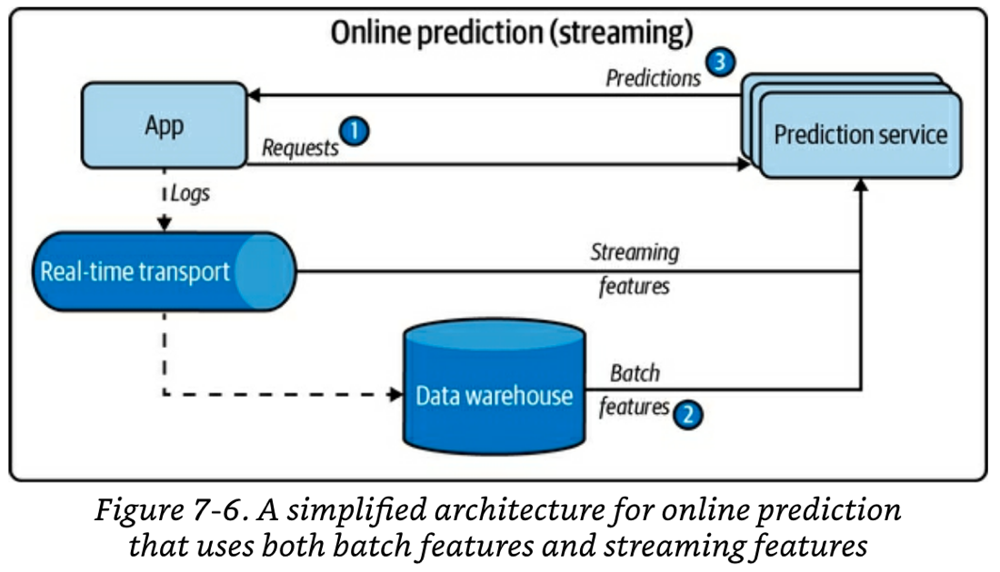

# 7 - Model Deployment and Prediction Service

With you ML model now selected, trained and evaluated, it is time to deploy to production. As with every other step in this book, this is an iterative process and you may need to go back to previous steps to rethink parts.  For this particular step this iterative nature is true because how a model serves and computes the predictions influences how it should be designed, the infrastructure it requires, and the behaviors that users encounter.

This chapter talks about:
- Some common myths around ML deployment to production.
- Explains the 4 main **modes of prediction serving**: 1. batch prediction, 2. online prediction that only uses batch features, 3. online prediction that uses both batch features and streaming features (aka streaming prediction) and 4. A hybrid between 1 and 2.
- Gives you some intuition of when to use batch prediction VS online prediction.
- Discusses the challenges of unifying the batch training data pipeline and the streaming prediction pipeline.
- **Model compression** techniques for increasing inference speed in ML models.
- Considerations about deploying your model on **the cloud VS the edge.**

Some introductory notes before we get started:
- *Production* means very different things for different teams. For some teams "production" is using your model in notebooks to do some data analysis.  For other teams "production" is keeping your model running to produce predictions for millions of users a day.  This chapter focuses on use cases closer tot he second.
- Some hard parts of *"deploying a model to production are"*: 
	- Making your model available to a large number of users with millisecond latency and 99% uptime.
	- Realising when a model is failing in production and automatically notifying the right person.
	- Seamlessly deploying updates to fix the production bugs.
- In some companies, the engineers that create the model are the same that deploy it and operate it. In some other companies, the engineers that create the model, export it and give it to a different team to deploy it.
	- Chip believes that the fist arrangement (you built it, you deploy it) is better.
- Deploying to production requires *"exporting the model"* (aka serialization).  Models have two parts that can be exported: the model definition and the model parameters. Usually the two artefacts are exported together.
	- Examples of export functions for TF and PyTorch are: `tf.keras.Model.save` and `torch.onnx.export()`

## ML Deployment Myths

### Myth 1: You Only Deploy One or Two ML Models at a Time
This is false. Medium to large companies have many, many ML models running concurrently in production. It is common to find at least one model per application feature. e.g. predict ride demand, predict driver availability, estimate time of arrival, dynamic pricing, etc.

### Myth 2: If We Don't Do Anything, Model Performance Remains the Same
Like software systems, ML systems suffer from "software rot". Additionally, ML systems also suffer from [data distribution shifts](08-data-distribution-shifts-and%20monitoring-in-production.md) over time and that shift will hurt performance. This is why ML models tend to perform best right after training.

### Myth 3: You Won't Need to Update Your Models as Much
Related to the performance decay mentioned above, we want to update models as often as possible. Cadences of "once a month" or "once a quarter" are typical. However, there are companies that con do updates every X minutes if needed.

### Myth 4: Most ML Engineers Don't Need to Worry About Scale
This is false. Most ML engineers are employed by medium or large size companies. It is fairly common for companies of this size to have models that need to produce several hundred inferences per second or deal with millions of users.

## The Four Modes for Serving Predictions

Note: terminology on this topic is still murky in the community. You may find different terms to refer to similar concepts.

There are three main modes of serving predictions in production plus one hybrid mode:
1. **Batch prediction**: uses only batch features, runs a scheduled or triggered job to mass produce predictions and store them in a database. At inference time, the prediction is looked up from the DB.
	1. **Pros:** 
		1. The pre-calculated predictions can be retrieved very fast and presented to the user.
		2. Batching up several inferences to take advantage of GPU vectorisation is a natural step. Inference batching leads to a high prediction throughput.
		3. You can increase your prediction throughput even more by dividing the data that needs inference and sending it to different parallel nodes.
	2. **Cons:**
		1. You may generate predictions for users that don't use your app frequently enough to use those predictions.
		2. You cannot take into account data that became available "right now" to include in your predictions. Your predictions are reflective of the state of the world when the last feature calculation job ran.
	3. **When to use:** 
		1. When you need fast retrieval of a prediction and it is ok to use features that may not be up to date. In other words, when *"online prediction that uses only batch features (mode 2)"* isn't fast enough of cheap enough.  For this mode to be viable it must be acceptable to calculate and store predictions for all queries (e.g. all users). 
		2. Another use case for this mode is when you need a prediction for all possible queries to then find out some overall aggregate statistic over the population. For example, you want to reach out to the top 10% of customers that are likely to churn next month.
2. **Online prediction that uses only batch features:** the inference computation itself is done on the fly and on demand but all the features required have been pre-computed and no live calculation of streaming features is required.
	1. **Pros:**
		1. You only generate predictions for the users that actually need it.
	2. **Cons:**
		1. You cannot take into account data that became available "right now" in the features.
		2. Batching up inference requests to use GPU vectorisation at inference is a bit harder because we need to deal with time windows for batching.
		3. Predictions will be slower to present to the user.
	2. **When to use:** When you can't afford to waste the computing effort of getting predictions for all your customer base and you are willing to compromise speed of retrieval. You must also be ok to use pre-computed features.
3. **Online prediction that uses both batch features and streaming features (aka streaming prediction):** the inference computation is done on the fly and on demand. Some features for the model are pre-computed and some need to be "fresh" so they need to be calculated on the fly using streaming features. For this mode to work your system needs near real-time transport and stream computation of data. See diagram below. 
	1. **Pros:** 
		1. You only generate predictions for the users that actually need it.
		2. You can take into account data that became available "right now" for feature calculation.
	2. **Cons:**
		1. Batching up inference requests to use GPU vectorisation at inference is a bit harder because we need to deal with time windows for batching.
		3. Predictions will be even slower than *"online  prediction that uses only batch features"* because we need to wait for both streaming features to get computed and then inference.
	3. **When to use:** when it is critical for predictions  to take into account data that has just been generated. Fraud detection of transactions and logins are a typical example. 
4. **Hybrid between modes 1 and 2 (batch and online with batch features):**  precompute predictions for popular queries (e.g. users that login frequently) and generate online predictions using mode 2 for less popular queries.
	1. **Pros:**
		1. The problem of wasting resources for calculating and storing inferences for infrequent queries is solved.
	2. **Cons:**
		1. You need to figure out what constitutes a "frequent query"
		2. Increase complexity because you need to deal with both a batched system and an online system.
		3. This mode still can't  take into account data that became available "right now" in the features.
	3. **When to use:** when you need to provide very fast prediction retrieval to common queries (like mode 1) but you can't afford to pre-calculate predictions for all queries. The benefits of faster prediction retrieval needs to outweigh the increased complexity.

\*The terms “online prediction” and “batch prediction” can be confusing. In this context they are referring to *when* the predictions are made. Both can make predictions for multiple samples at the same time (i.e. group inference requests in batch) to take advantage of GPU vectorisation optimisations. Both can also deal with one sample at a time.

### Streaming Prediction > Unifying the Batch Training Pipeline with the Streaming  Serving Pipeline

This section is mostly relevant for serving mode 3: *"Online prediction that uses both batch features and streaming features"*.

It is not uncommon to find companies that have a batch data pipeline that gets used to build features for training and a **different** data pipeline to calculate features on the fly at inference time.

Having two different pipelines is a common cause of bugs in ML because changes in one pipeline do not get propagated to the other one, causing feature drift.

Building infrastructure to unify the batch pipeline and the streaming pipeline has become a very popular topic. Companies typically try to solve the problem by using [feature stores](10-infrastructure-and-tooling-for-ml-ops.md#Feature%20Stores) or building in-house tooling based on stream computing technology like Apache Flink.

## Faster Inference through Model Compression
There are 3 ways you can reduce inference latency if needed:
1. **Model compression:** Make the model smaller. This is the focus of this section.
2. **Inference Optimization:** tweak computation and compilation parameters to reduce inference latency. More about this in the ["Model Optimization"](07-model-deployment-and-prediction-service.md#Optimization) section below.
3. **Faster hardware:** buy better hardware or make the one you have run faster. 

Originally, model compression was developed  to help make models smaller so they could fit  on edge devices. However, making models smaller typically makes them run faster so compression is also now being used to speed up inference in non-edge scenarios.

Note that compression also has ripple effects in the fairness space. Go to [chapter 11](11-the-human-side-of-ml.md#Compression%20vs%20fairness%20trade-off) for more info.

There are 4 common techniques for model compression:
1. Low-rank factorization
2. Knowledge distillation
3. Pruning
4. Quantization 

### Low-rank factorization
- **Intuition:** replace high-dimensional tensors with lower dimension ones.
- **Example:** *compact convolutional filters* for CNNs.
- **Cons:** Low-rank methods tend to be specific for certain types of models and require a deep understanding of the underlying architectures. Because of this, they are not used on a wide arrange of use cases yet.

### Knowledge Distillation
- **Intuition:**  a small model (student) is trained to mimic a larger model or ensemble of models (teacher). The smaller model is what you’ll deploy.
- **Example:** DistilBERT (student) reduces the size of a BERT model (teacher) by 40% while retaining 97% of its language understanding capabilities and being 60% faster.
- **Pros**: works regardless of the architectural differences between teacher and student. For example, you can have a random forest student and a transformer NN teacher.
- **Cons:** You need to have a teacher model available.

### Pruning
- **Intuition:** inspired by pruning of decision trees (removing tree branches that are unnecessary or redundant). In the context of neural networks, pruning takes 2 forms:
	- Removing entire nodes, which reduces the number of parameters. This form is less common.
	- More common: find parameters that contribute little to prediction and set them to 0. The architecture remains the same but the number of non-zero parameters can be dramatically decreased. Sparse models tend to require less storage space and have higher computational performance. Experiments show up to 90% reduction in size while maintaining the overall accuracy.
- **Pros:** works regardless of the architecture of the NN.
- **Cons:** Pruning can introduce biases to your model, more on this on chapter 11.
	- #todo : link the right section
- **Notes:** pruning has also been used to as an architecture search tool to determine which nodes are important, re-architecting the model and retraining . However, some studies have showed that large sparse models outperform re-architected and re-trained models.

### Quantization
- **Intuition:** Instead of using 32-bit precision floats to store parameters, use less bits. 
	- Less bits per parameter means smaller memory footprint of the model. 
		- Less memory  means that you could train bigger models if you want to (if you use *quantization during training*).
		- Less memory also means that you can increase the batch size, speeding up training computation (if you use *quantization during training*).
	- Less precision in floating numbers also means less computation needed to achieve the desired precision, speeding up both training and inference.
- **Types:**
	- Types by target precision:
		- 16-bits a.k.a "low-precision"
		- 8-bit s a.k.a integer quantization a.k.a "fixed-point"
			- Fixed-point inference has become an industry standard for inference on the edge. 
			- Google’s TensorFlow Lite, Facebook’s PyTorch Mobile, NVIDIA’s TensorRT all offer *post-training fixed-point* quantization with a few lines of code.
		- 1-bit a.k.a binary weight networks 
	- Types by when the quantization is applied:
		- **Quantization during training**: train in a low precision from the start.
		- **Quantization post-training**: train at full precision and then quantizise the trained model just for inference.
- **Pros:** 
	- All forms of quantization are straightforward to do with existing libraries and generalizes well to several model types.
	- Low-precision training has become very popular and training hardware has started to provide direct hardware support for it (e.g. NVIDIA GPS and Google TPUs)
		- As of 2022 fixed-point *training* is not yet very popular but it has shown promising results.
- **Cons:**
	- Less precision means  fewer numbers can be represented. This introduces risks of precision rounding errors and number boundary overflow. **Small rounding errors can lead to dramatic changes in performance.**
		- Efficient rounding and scaling is non-trivial. However, luckily major frameworks have this built-in.

### More Compression Resources
- [“The Top 168 Model Compression Open Source Projects”](https://oreil.ly/CYm82)
- “Survey of Model Compression and Acceleration for Deep Neural Networks" Cheng et al, 2020.

## ML on the Cloud and on the Edge

You will face the decision on where you want the main chunk of the inference computation to happen. Computation can happen on **the cloud** or on **the edge**.

### The cloud
#### Pros
- The easiest way to deploy a model. You rarely have to worry about the compatibility of your model and the hardware it runs on. 

#### Cons 
- ML inference cloud bills can be substantial. Small and medium company costs can be between $50K to $2M a year. The more computation you shift to the edge, the less you pay.
- The cloud introduces network latency to the inference. In many cases network latency can be a bigger bottleneck than inference latency.
- The feature is dependent on the customer having internet access.

### The edge
Browsers, phones, laptops, smartwatches, cars, security cameras, robots, embedded devices, FPGAs (field programmable gate arrays), and ASICs (application-specific integrated circuits).

Because of its popularity, companies are in a race to develop edge devices optimized for different ML use cases. Established companies including Google, Apple, and Tesla have all announced their plans to make their own ML-optimized chips.

#### Pros
- Works with no internet.
- May be the only way to go if your use case has strict "no-internet" policies.
- Overall latency may get reduced because of no network latency.
- Useful for cases where you are dealing with sensitive data and you don't want to send that over the network (e.g. fingerprints, faceID).
- Edge computation makes it easier to comply with privacy regulations like GDPR.

#### Cons
- Your model may not be compatible to run on the target hardware or may not run efficiently.
	- Hardware manufacturers and framework creators typically take a long time to add support for new hardware or new frameworks in existing hardware as it is a very challenging task.
- Compilation of a model to run on different target hardwares is a difficult and time consuming tasks that requires lots of manual effort.
- Optimizing models for different hardware architectures is very hard. If you are an applied ML engineer you typically don't need to do this. This is usually done by the ML framework developers. If you are a researcher, you may need to do this.
- Edge devices need be powerful enough, have enough memory and enough battery to be able to run your model. All of these add variables that are hard to control to your solution.

### Compiling and Optimizing Models for Edge Devices
Compilation is the process of transforming your ML model into an artefact that can run in a target hardware. Optimization is the process making tweaks to the model or artefact to take advantage of the target hardware's properties and make it run faster.

#### Compilation
As an applied ML engineer, you would typically use a model compiler that is already created. 

Some compilers rely on a concept called **Intermediate Representations (IRs)**.  IRs are standardised intermediate formats that framework creators and hardware manufacturers  have both adopted to ease the creation of compilers and alleviate the hardware support problem.

#### Optimization
The fact that your model runs on a target architecture doesn't mean it may be able to do so efficiently. 

As an applied ML engineer, you would typically rely on compiler or hardware optimizations and you would not go optimize the hardware operations yourself. 

ML framework developers and hardware manufacturers spend large sums of money hiring specialised **optimization engineers** that know both about ML and hardware architectures. 

Note that even if you are not an optimization engineer, you can still optimize your code.

##### Manual Model Optimization
**Optimization engineers** use heuristics to find ways to make the models run faster. Hand-made heuristics have the problems of not being optimal and being inflexible when the underlying ML framework or hardware architecture changes.

##### Using ML for Model Optimization
Use ML to narrow down the search of an optimal operation order instead of relying on heuristics. This has the advantage of being closer to optimality and being flexible to adapt to changes in ML frameworks and hardware.

The results of ML-powered compilers are impressive. As an applied ML engineer you **optimize your model once for one hardware backend then run it on multiple devices of that same hardware type.** Take into account that ML-powered optimizers can take hours and sometimes days to run.

### ML in browsers
In principle, if you manage to make your model run efficiently in a browser, then you don't need to worry anymore about target hardware, compilation and optimization.

People usually think about Javascript when talking about browsers. There are libraries to transform models into Javascript browser-runnable artefacts. However, JS is not fundamentally well suited for ML and therefore it is not recommended to use it.

A promising alternative is models that get compiled into WebAssembly (WASM). WASM is much faster than JS and as of 2021  93% of browsers supported it.

WASM is still slow compared to running models in their native hardware through iOS or Android apps.

