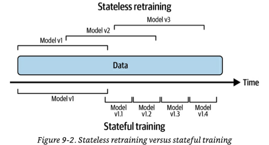
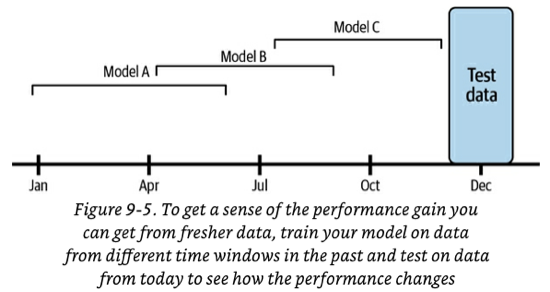
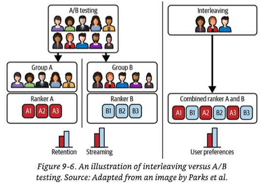
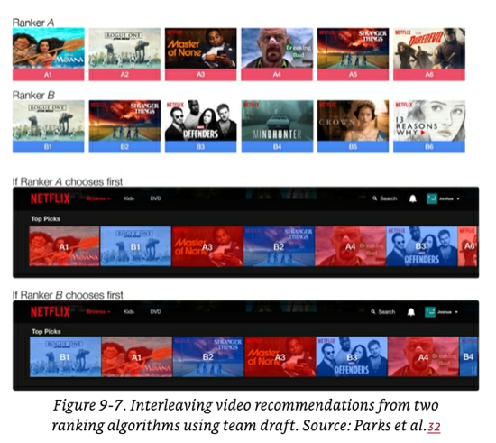

# Chapter 9 - Continual learning and test in production

This chapter covers two big and related topics: [Continual Learning](#Continual%20Learning) and [Testing models in Production](#Testing%20models%20in%20Production). The goal of studying these two topics in tandem is to learn how to update your models in production in an automated, safe and efficient manner.

The whole chapter is a continuation deep dive into the most common technique used to correct data-distribution shifts briefly discussed in chapter 8:  [retrain your models periodically](08-data-distribution-shifts-and%20monitoring-in-production.md#Retrain%20models%20periodically).

# Continual Learning
*Continual Learning* is the idea of updating your model as new data becomes available; this makes your model keep up with the current data distributions.  

Once your model is updated, it cannot be blindly released to production. It needs to be tested to ensure that it is safe and that it is better than the current model in production.  This is where the next section ["Testing models in Production"](#Testing%20models%20in%20Production)  comes in.

*Continual learning* is often misinterpreted:
- *Continual learning* is NOT referring to a special class of ML algorithms that allow for incremental update of the model when every single new datapoint becomes available. Examples of this special class of algorithms are *sequential bayesian updating* and *KNN classifiers*.  This class of algorithms is small and is sometimes referred to "online learning algorithms".
	- The concept of *Continual learning* can be applied to any supervised ML algorithm. No just a special class.
- *Continual learning* does NOT mean starting a retraining job every time a new data sample becomes available. In fact this is dangerous, because it makes neural networks susceptible to catastrophic forgetting. 
	- Most companies using *continual learning* update their models in micro-batches (say every 512 or 1024 examples). The optimal number of examples is task dependent.

Continual learning might look like a data scientist task in the surface. However more often than not, it requires a lot of **infrastructure work** to enable it.

## Why Continual Learning?

The base reason for it is to help your model **keep up with data distribution shifts**. There are some use cases in which adapting quickly to changing distributions is critical. Here are some examples:
- **Use cases in which unexpected and rapid changes can happen:** Use cases like ride-sharing are subject to this. For example, there might be a concert in a random area in a random Monday and the "Monday pricing ML model" may not be well equipped to handle it.
- **Use cases in which it is not possible to get training data for a particular event**. An example of this are e-commerce models in Black Friday or some other sale event that has never been tried before.  It is very hard to gather historical data to predict user behaviour in Black Friday, so your model must adapt throughout the day. 
- **Use cases that are sensitive to the cold start problem**.  This problems happens when your model has to make predictions for a new (or logged out) user that has no historical data (or data is outdated).  If you don't adapt your model as soon as you get some data from that user, you won't be  to recommend relevant things to that user.

## Concept: Stateless retraining VS Stateful training

### Stateless retraining
Retrain your model from scratch each time, using randomly initialised weights and fresher data.
- There might be some overlap with data that had be used for training  previous model version.
- Most companies start doing continual learning using stateless retraining.

### Stateful training (aka fine-tuning, incremental learning)
 
Initialise your model with the weights from the previous training round and continue the training using new unseen data.

- Allows your model to update with significantly less data.
- Allows your model to converge faster and use less compute power. 
	- Some companies have reported 45 reduction in compute power.
- It theoretically makes it possible to avoid storing data altogether once the data has been used for training (and leaving some margin of safety time). This theoretically eliminates data privacy concerns.
	- In practice, most companies have a practice of let's-keep-track-of-everything and are reluctant about throwing away data even if it is not needed anymore.
- Every now and then you will need to run **stateless retraining** with a large amount of data to re-calibrate the model. 
- Once your infrastructure is setup correctly, changing from stateless retraining to stateful training becomes a push of a button.
- **Model iteration vs data iteration**: Stateful training is mostly used to incorporate new data **into an existing and fixed model architecture** (i.e. data iteration). If you want to change your model's features or architecture, you will need to do a first-pass of stateless retraining.
	- There has been some research on how to port weights from one model architecture to a new one ([Net2Net knowledge transfer](https://arxiv.org/abs/1511.05641), [model surgery](https://arxiv.org/abs/1912.06719)). There is little to no adoption on these techniques in industry yet.

## Concept: feature reuse through log and wait
Feature get calculated for inference. Some companies store the calculated features for every data sample to be able to reuse them for continual learning training and that way save some computation.  This is known as **log and wait.**
- This is also used [to assist with feature monitoring](08-data-distribution-shifts-and%20monitoring-in-production.md#Monitoring%20features)
- As of Jan 2023, log and wait is not yet popular but it is gaining traction.

## Continual Learning Challenges
Continual learning has been applied in industry with great success. However it has three major challenges that companies need to overcome.

### Fresh data access challenge
If you want to update your model every hour. You need **quality** **labelled** training data every hour. The shorter the update cadence, the more critical this challenge becomes.

#### Problem: Speed of data deposit into data warehouses
Many companies pull their training data from their data warehouses like Snowflake or BigQuery. However, data coming from different sources is deposited into the warehouse using different mechanisms and at different speeds.

For example, parts of the data in the warehouse may be pulled directly from real-time transport (events) but part of it may be coming in from daily or weekly ETLs that copy the data over from other sources. 

A common approach to solve this is to pull data directly from real-time transport for training before it is deposited in the warehouse. This is especially powerful when the real-time transport hooked into a [feature store](10-infrastructure-and-tooling-for-ml-ops.md#Feature%20Stores). There are some challenges to achieving this:
- You may not have all your data pumping through events. This is especially common for data that lives in external vendor systems that you can't control. If you depend on that data being fresh, you will need to figure out a way to capture changes on those systems using events. Web-hooks or polling APIs to re-emit events are common solutions.
- In some companies, batched ETLs tend to do a lot of heavy lifting processing and joining data that has made it to the data warehouse to make it more useful. If you change to full real-time transport strategy, you need to figure out how to do that same processing on a stream of data.

#### Problem: Speed of labelling
The speed at which you can label new data is often the bottleneck. The best candidates for continual learning are tasks that have [natural labels **with short feedback loops**](04-training-data.md#Natural%20labels) (the shorter the feedback loop the faster you can label).

If natural labels are not easy to obtain in the timeframe needed, you can also try  [weak-supervision or semi-supervision](04-training-data.md#Handling%20the%20Lack%20of%20Labels) techniques to get them in time (at the cost of potentially noisier labels). As a last resort you can consider recurrent and fast crowdsourcing label annotation.

Another factor that impacts labelling speed is the  **label computation strategy:**
- You can do label computation in batch. These batch jobs typically run periodically over data that has been deposited into the data warehouse. The labelling speed is therefore a function of both the speed of data deposit and the cadence of the label computation job.
- Similar to the solution above, a common approach to increase the speed of labelling is to compute the labels from real-time transport (events) directly. This streaming computation has its own challenges.

### Evaluation Challenge

Adopting continual learning as a practice comes at the risk of catastrophic model failures. The more frequent the model update, the more opportunities for your model to fail.

Additionally, continual learning opens the door **to coordinated adversarial attacks to poison the models**.

This means that [testing your models](#Testing%20models%20in%20Production) before rolling them out to a wider audience is critical.
- Testing takes time so this may be another limiting factor on the fastest model update frequency you can get.
- e.g. A new model for fraud detection can take about 2 weeks to get enough traffic to be confidently evaluated.

### Data scaling challenge
Feature calculation typically requires [Scaling](05-feature-engineering.md#Scaling).  Scaling  requires access to global data statistics like min, max, average and variance.

If you are using stateful training, the global statistics must consider both the previous data that has already been used to train the model plus the new data being used to refresh it. Keeping track of global statistics in this scenario can be tricky.

A common technique to do this is to calculate or approximate these statistics incrementally as you observe new data (as opposed to loading the full dataset at training time and calculating from there).
- An example of this technique is "Optimal Quantile Approximation in Streams".
- Sklearn’s StandardScaler has a `partial_fit` that allows a feature scaler to be used with running statistics. However, the built-in methods are slow and don’t support a wide range of running statistics.

### Algorithm challenge

This challenge manifests when you use  certain types of algorithms and you want to update them *really fast* (e.g. every hour). 

The algorithms in question are algos that, by design, rely on having access to the full dataset to get trained. For example,
matrix-based, dimensionality reduction-based and tree-based models. These types of models cannot be incrementally trained with new data like neural networks or other weight-based models can. 
- e.g. You cannot do PCA dimensionality reduction incrementally. You need the full dataset.

The challenge only happens when you need to update them *really fast* because you cannot afford to wait for for the algorithm to go over the full dataset.

There are some variants of the affected models that have been designed to be incrementally trained, but the adoption of these algorithms is not widespread. An example is Hoeffding Trees and sub-variants.

## The Four Stages of Continual Learning
Companies usually move towards continual learning in four stages. 

### Stage 1: Manual, stateless retraining

Models only get retrained when two conditions are met: (1) the model's performance has degraded so much that it is now doing more harm than good, (2) your team has time to update it.

### Stage 2: Fixed schedule automated stateless retraining
This stage usually happens when the main models of a domain have been developed and therefore your priority is no longer to create new models, but to maintain and improve the existing ones. Staying in stage 1 has grown into a pain too big to be ignored.

Retraining frequency at this stage is typically based on "gut feeling".

The inflection point  between stage 1 and stage 2 is usually a script that someone writes that runs the stateless retraining periodically. Writing this script can be very easy or very hard depending on how many dependencies need to be coordinated to retrain a model.

The high level steps of this script are:
1. Pull data.
2. Downsample or upsample data if necessary.
3. Extract features.
4. Process and/or annotate labels to create training data.
5. Kick off the training process.
6. Evaluate the new model.
7. Deploy it.

There are 2 additional pieces of infrastructure you will need to implement the script:
1. A [scheduler](10-infrastructure-and-tooling-for-ml-ops.md#Cron%20Schedulers%20and%20Orchestrators) 
2. A  [model store](10-infrastructure-and-tooling-for-ml-ops.md#Model%20Store) to automatically version and store all the artefacts needed to reproduce the model. Mature model stores are AWS SageMaker and Databrick's MLFlow.

### Stage 3: Fixed schedule automated stateful training
To achieve this you need to reconfigure your script and a way to track your data and model lineage. A simple model lineage versioning example:
- V1 vs V2 are two different model architectures for the same problem.
- V1.2 vs V2.3 means that model architecture V1 is in its 2nd iteration of a full stateless retraining and V2 is in its 3rd.
- V1.2.12 vs V2.3.43 means that there had been 12 stateful trainings done on V1.2 and 43 done on V2.3.
- You will probably need to use this along other [versioning](06-model-development-and-offline-evaluation.md#Versioning) techniques like data versioning to keep track of a full picture of how the models are evolving.
- According to the author, she is not aware of any model store that has this type of model lineage capabilities so companies build their own in house.
- At any give point in time, you will have multiple models running in production at the same time through the arrangements described in [Testing models in Production](#Testing%20models%20in%20Production).

### Stage 4: Continual learning
In this stage the **fixed schedule** part of previous stages gets replaced by some **re-training trigger mechanism**. The triggers can be:
- **Time-based**
- **Performance-based**: e.g. the performance has dropped below x%.
	- [You cannot always directly measure accuracy in production, so you may need to use some weaker proxy](08-data-distribution-shifts-and%20monitoring-in-production.md#Monitoring%20accuracy-related%20metrics).
- **Volume-based:** The total amount of labelled data increases by 5%
- **Drift-based:** e.g. when a "major" data distribution shift  [is detected](08-data-distribution-shifts-and%20monitoring-in-production.md#Detecting%20Data%20Distribution%20Shifts).
	- The hard thing of using a drift-based trigger is that, as mentioned in the previous chapter, data distribution shifts are only a problem if they cause your model's performance to degrade. It can be tricky to know when that happens.

## How often to Update your models

To answer this question you first need to understand and determine **what is the gain you get when you update your model with fresh data.** The more the gain, the more frequently it should be retrained.

### Measuring the value of data freshness

One way to quantify the value of fresher data is to train the same model architecture with data from 3 different periods of time and then testing each model against current labelled data (see image).

If you discover that letting the model stale for 3 months causes a 10% difference in the current test data accuracy,  and 10% is unacceptable, then you need to retrain in less than 3 months.

\*The image shows examples with multi-month datasets but your use case may require more fine-grained time buckets like weeks, days or even hours.

### When should I do model iteration?

Most of this chapter so far has been referring to updating your model with new data (i.e. data iteration). However, in practice, you may also need to change the architecture of your model from time to time (i.e. model iteration).  Here are some pointers to when you should and should not consider doing model iteration:
- If you keep reducing the data iteration retraining trigger and you are not gaining much, you should probably invest in finding a better model (if your business needs one of course).
- If changing to a larger model architecture that requires 100X compute power gives 1% performance improvement ,but reducing the retraining trigger to 3 hours also gives you 1% performance increase with 1X compute power, favour the data iteration over the model iteration.
- The "when to do  model iteration vs data iteration" question is still not well answered by research for all tasks. You will need to run experiments on your specific task to find out when to do which. 

# Testing models in Production

To sufficiently test your models before making them widely available you need both **pre-deployment offline evaluations** AND **testing in production.** Offline evaluations alone are not sufficient.

Ideally, each team lays out a clear pipeline of how models are evaluated: which tests to run, who runs them  and the thresholds that apply to promote a model to the next stage. It is best if these evaluation pipelines  are automated and kicked-off when there is a new model update. The stage promotions should be reviewed similar to how CI/CD is evaluated in software engineering.

## Pre-deployment offline evaluations
- In [Chapter 6 > Model Offline Evaluations](06-model-development-and-offline-evaluation.md#Model%20Offline%20Evaluation) we discussed some evaluation techniques that can be used for model selection. The same evaluations can be reused for pre-deployment offline evaluations.
- The most common two are (1) Using a **test split**  to compare against a baseline and (2) running **backtests**.
	- **Test splits** are  usually **static** so that you have a trusted benchmark to compare multiple models. This also means that good performance on a static old test split does not guarantee good performance  under the current data distribution conditions in production.
	- **Backtesting** is the idea of using the freshest labelled data **that hasn't been seen by the model during training** to test performance (e.g. if you used with data for the last day, use data for the last hour to backtest).
		- We hadn't introduced **backtests** yet. This is the first time we are mentioning them in this summary.
		- It might be tempting to say that backtesting is sufficient avoid testing in production, but that is not the case. Production performance is much more than label-related performance. You still need to observe things like  latency, user behaviour with the model and system integration correctness to ensure your model is safe for wide rollout.

## Testing in Production Strategies 

### Shadow Deployment
- **Intuition:** Deploy the challenger model in parallel with the existing champion model. Send every incoming request to both models but only serve the inference of the champion model. Log the predictions for the both models to then compare them.
- **Pros**
	- This is the safest way to deploy your models. Even if your new model is buggy, predictions will not be served.
	- It is conceptually simple.
	- Your experiment will gather enough data to achieve statistical significance faster than all other strategies as all models receive full traffic.
- **Cons**
	- This technique can't be used when measuring model performance depends on observing how the user interacts with the predictions. For example, predictions from shadow recommender models will not be served so you won't be able to know if the user would have clicked on them or not.
	- This technique is expensive to run because it doubles the number of predictions and therefore the number of compute required.
	- If inference happens using any of  [the online prediction modes](07-model-deployment-and-prediction-service.md#The%20Four%20Modes%20for%20Serving%20Predictions) you will need to figure out how to deal with edge cases like:
		- What if the shadow model takes much longer than the primary model to serve a prediction?
		- What if the shadow model fails? Should the primary also fail or not?

### A/B Testing
- **Intuition:** deploy the challenger model alongside the champion model (model A) and route *a percentage of traffic\** to the challenger (model B). Predictions from the challenger **are shown** to the users. Use monitoring and prediction analysis on both models to determine if the performance of the challenger is statistically better than the champion. 
	- \* Some use cases don't play nice with the idea of dividing traffic and having multiple models at the same time. In these cases, the A/B testing can be done by doing *temporal splits:* one day model A, next day model B.
	- The traffic split **must be a truly randomized experiment.** If you bake in any selection bias on who gets model A vs model B (like desktop users get A and mobile get B), your conclusions will be incorrect.
	- The experiment must run long enough to capture enough samples to achieve enough statistical confidence of the difference.
	- Statistical significance isn't fool proof (that is why it has a confidence). If there is no statistical difference between A and B, you can probably use either.
	- There is nothing stopping you from running A/B/C/D tests if you want to.
- **Pros:**
	- Since predictions are served to users, this technique allows you to fully capture how users are reacting to different models.
	- A/B testing is simple to understand and there are a lot of libraries and documentation around it.
	- It is cheap to run because there is only one prediction per request.
	- You won't need to consider the edge cases that arise from parallelising inference requests for online prediction modes (see cons of shadow deployments).
- **Cons:**
	- It is less safe than shadow deployments. You want some stronger offline evaluation guarantee that your model will not miserably fail since you will be putting real traffic through it.
	- You have an inherent choice to make between assuming more risk (routing more traffic to the B model) VS gaining enough samples to make an analysis faster.

### Canary Release
- **Intuition:** deploy challenger and champion side by side but start with the challenger taking no traffic. Slowly move traffic from the champion to the challenger (aka the canary). Monitor the performance metrics of the challenger, if they look good, keep going until all traffic is going to the challenger.
	- Canary releases can be paired with A/B testing for rigorous measurement of performance differences.
	- Canary releases can also be run in "YOLO mode", in which you eyeball the  performance difference.
	- Other version of a canary release can be to release the challenger model to a smaller market first and then promote to all markets if everything looks good.
	- If the challenger model starts having issues, re-route traffic to the champion. 
- **Pros:**
	- Easy to understand.
	- Simplest of all strategies to implement if you already have some feature flagging infrastructure in you company.
	- Since challenger predictions will be served, you can use this with models that require user interaction to capture performance.
	- Compared to shadow deployments it is cheaper to run. One inference per request.
	- If paired with A/B testing, it allows you to dynamically change the amount of traffic that each model is taking.
- **Cons:**
	- It opens the possibility to not be rigorous in determining performance differences.
	- If releases are not supervised carefully, accidents can happen. This is arguably the least safe option but it is very easy to rollback.

### Interleaving Experiments 
- **Intuition:** In A/B testing a single user either gets the predictions from model A or model B. In interleaving, a single user gets interleaved predictions from both model A and model B. We then track how each model is doing by measuring user preference with each model's predictions (e.g. users click more on recommendations from model B)
	- Recommendation tasks are a typical use case for interleaving. Not all tasks are a good fit for the this strategy.
	- You want to avoid giving a model an unfair user preference advantage like always taking the top prediction from model A. It should be equally likely that the first slot comes from model A than from model B. The rest of the positions can be filled using the **team-drafting method** (see image).

- **Pros:**
	- Netflix found experimentally that interleaving reliably identifies the best model with **considerably smaller sample size** compared to traditional A/B testing.
		- This is largely because both models get full traffic.
	- Contrary to shadow deployments, this strategy allows you to capture how users are behaving against your predictions  (because predictions are served).
- **Cons:**
	- The implementation is more complex than A/B testing.
		- You need to worry about edge cases on what to do if one of the interleaved models is taking too long to respond or fails.
	- It doubles the compute power needed because every request gets predictions from multiple models.
	- It cannot be used for all types of tasks. For example, it works for ranking/recommendation tasks but  it doesn't make sense for regression tasks.
	- It does not easily scale to a large number of challenger models. 2-3 interleaved models seems to be the sweet spot.

### Bandits
- **Intuition:** Bandits are an algorithm that keeps track of the current performance of each model variant and makes a dynamic decision on every request on whether to use the model that is  most performant so far (i.e. exploit the current knowledge) or try out any of the other models to gain more information about them (i.e. explore in case one of the other models is actually better). 
	- Bandits add another concept to the decision of which model to use:  **opportunity cost**. 
	- Bandits cannot be applied on all cases. For bandits to be applicable your use case needs:
		- To be making online predictions. Batched offline predictions are not compatible with bandits.
		- You need short feedback loops to determine whether the prediction was good or not and a mechanism to propagate that feedback into the bandit algorithm to update the payoff of each model.
	- There are many bandit algorithms. The simplest is called `epsilon-greedy`. The two most powerful and popular are `Thompson Sampling` and `Upper Confidence Bound (UCB)`.
- **Pros:**
	- Bandits need a loss less data than A/B testing to determine which model is better. An example given in the book mentions 630K samples to gain 95% confidence with A/B testing VS 12K with bandits.
	- Bandits are more data efficient while simultaneously minimising your **opportunity cost**. In many cases bandits are considered optimal.
	- Compared to A/B testing, bandits are safer because if a model is really bad, the algorithm will select it less often. Also convergence will be faster so you will be able to eliminate the bad challenger quickly.
- **Cons:**
	- Compared to all other strategies, bandits are much harder to implement because of the need to propagate the feedback into the algorithm continuously.
	- Bandits can only be used on certain use cases (see above).
	- They are not as safe as [Shadow Deployments](#Shadow%20Deployment) because challengers take live traffic. 

#### Side note: Using contextual bandits to improve recommendation algorithms

This sub-section is NOT related to testing models in production, but we will mention it given that we are already talking about bandits.

There is a sub-category of bandit algorithms called **contextual bandits.** Contextual bandits not only take into account each  option's historical "payoff" to make a "exploit vs explore" decision. They also consider additional information (i.e. a context). This context can be: information about the user, information about the time of day/year, information about the product. With both the payoff and the context, contextual bandits can make a "personalised" explore vs exploit decision.

Contextual bandits have been use to great success on recommendation tasks, improving performance significantly. For example, in an e-commerce setting they can be used to decide wether to show **YOU** a product **YOU** are likely to buy (exploit) or some other product **YOU** have not seen in the past (explore).  Note that this decision is made for **YOU**, considering information about you and possibly information about the possible products as context.

Contextual bandits can be used "solo" as recommendation algorithms that do not need any training data. They start with no context and no payoff, take a guess on what to recommend and learn as they go.

They can also be combined with deep learning to improve recommendations performance. See [this paper](https://arxiv.org/abs/2008.00727) by Twitter engineering if you are interested.

Contextual bandits can also be used to combat [degenerate feedback loops](08-data-distribution-shifts-and%20monitoring-in-production.md#Degenerate%20feedback%20loops).

The main downside of contextual bandits is that they are even harder to implement than "normal" bandits. Their implementation depends on the underlying ML model's architecture (e.g tree vs neural network), making them less generalizable. 

