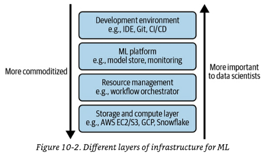
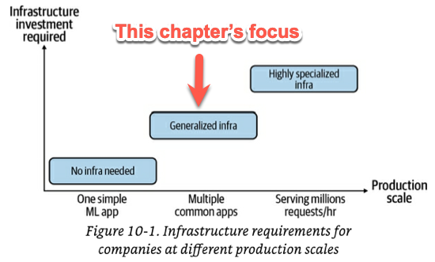

# Chapter 10 - Infrastructure and Tooling for ML Ops

It is not uncommon to find data scientists that know the right things to do for their ML systems but that can't do them because their infrastructure does not support them. 
- When setup right, infrastructure can help automate processes, reducing the need for specialised knowledge and engineering time.
- When setup wrong, infrastructure is painful to us and expensive to replace.

ML infra can be grouped into 4 layers. This chapter will cover each layer. Note that chapter presents the layer in loose order of *"familiarity to an average developer"*  to ease comprehension.

The chapter ends with a discussion on how to navigate the **"build vs buy" decision**.

## Infrastructure requirements follow company scale
The infrastructure required for your team depends on how specialised your applications are:
- At one side of the spectrum there are companies that use ML for ad-hoc business analytics like quarterly reports or next year forecasts. 
	- The result of their work usually goes into a report or a slideshow. 
	- These companies don't need to invest in infrastructure as all they need is Jupyter Notebooks.
- At the other end of the spectrum, there are the companies that are pushing the envelope on the scale of use of ML. 
	- They have extremely low latency requirements, or they process petabytes of new data a day, or they need to do millions of predictions per hour. 
	- These are companies like Tesla, Google and Facebook. 
	- These companies usually have to develop their own specialised infrastructure. Some parts of this specialised infrastructure may be made publicly available later (like Google did through GCP).
- **The vast majority of companies live in the middle of the spectrum**. These are companies that use ML for *"common applications"*  at a *"reasonable scale"*.
	- *"Common applications"*:  fraud detection, churn prediction, recommender systems, etc.
	- *"Reasonable scale"*: 
		- Work with data in the order of gigabytes and terabytes, NOT petabytes.
		- The data science team has ten to a couple hundred engineers. NOT thousands.
	- These companies will likely benefit from using generalised ML infrastructure that has been increasingly standardised and commoditised. 
	- **This chapter focuses on the infrastructure needs of companies like this.**

## Layer 1: Storage and Compute

### The Storage Layer
Data storage has become so cheap that most companies just store all the data they have. We've discussed all the details about the storage layer in [Chapter 3 - Data Engineering Fundamentals](03-data-engineering-fundamentals.md) so we won't repeat them here.

The rest of this section will focus on the **compute layer.**

### The Compute Layer
- There are two common uses of the compute layer:
	- Execute jobs. In this case, compute units may only live for the length of the job.
	- Run Jupyter notebooks or other exploratory work. In this case, the compute units tend to be long-lived. They are usually called *virtual machines* or *instances*.
- Most commonly, the compute layer of a company is a managed cloud service like AWS Elastic Cloud or GCP.
- The most minimal compute layer would be a single CPU or single GPU that executes all your computation.
	- Some compute layer frameworks abstract away the notion of cores and use other units of computation. For example engines like Spark and Ray use "job" as their unit. Kubernetes uses "pod" as the smallest deployable unit.
- A compute unit is typically characterised by two metrics: **memory** and **operation speed**.
	- **Memory**: to execute a job, your unit first needs to load the required data into memory. The total memory determines how much data your unit can handle. The load and unload speed of data in and out of memory can also affect your total job time significantly. This is why cloud providers offer special instances that have **"high bandwidth memory"**.
	- **Operation speed:** the precise way to measure this is contentious and not uniform between cloud providers.
		- The most common metric is **FLOPS** - floating point operations per second. 
			- This is contentious because it is ambiguous what should be considered as a single "floating point operation". 
			- Also, it is nearly impossible to achieve 100% **utilisation rate** of your unit's rated FLOPs. 50% may be considered good.  Utilization rate depends load speed of data into memory speed.
		- [MLPerf](https://www.nvidia.com/en-us/data-center/resources/mlperf-benchmarks/#:~:text=MLPerf%E2%84%A2%20is%20a%20consortium,all%20conducted%20under%20prescribed%20conditions.) is a popular benchmark to measure hardware performance. It measures how long it takes the hardware to train common ML tasks.

#### Public Clouds VS Private Data Centers
- ML use cases tend to benefit from using public clouds **because ML workloads are bursty**. This means that you only pay for the compute during the work bursts and then free up the resources.
	- Cloud compute is elastic but not magical. It doesn't actually have infinite compute power and most cloud providers will impose limits on your account. You can often contact them and get those limits increased.
- **Early on**, using public clouds tends to give companies higher returns than buying their own storage and compute layers. However, **this becomes less defensible as the company grows**.
	- Cloud spending accounts for ~50% of the cost of revenue for large companies according to an a16z study.
	- The high cost of cloud has prompted large companies to start moving their workloads back to their own data centres.  This is called **cloud repatriation.**
		- Getting into the cloud is easy but moving away from it is very hard. Cloud repatriation requires non-trivial up-front investment in both hardware and engineering effort.

#### Multi-cloud strategies
- Multi-cloud means architecting your systems to use multiple cloud providers so that you can leverage the best and most cost-effective technologies of each provider and avoid vendor lock-in.
	- A common pattern in ML workloads is to do training on GCP or Azure, and then do deployment in AWS. Note that this is no necessarily a good pattern.
- Maintaining sanity in a multi-cloud strategy is very very hard. 
	- It is very hard to move data and orchestrate work-load across clouds.
- Often multi-cloud just happens by accident because different parts of the organization operate independently and make different choices. 
	- It is also not uncommon for ML companies to receive investments from parties that have interests in certain clouds and "force" the company to adopt that other cloud, resulting in multi-cloud arrangements.

## Layer 4: Development Environment

The dev environment is severely underrated and under invested in industry. Some experts suggest that if you only have time to invest in setting one part of infrastructure well, you should make it the DEV environment as any improvements made here translate directly into productivity.

The DEV environment as a whole is made of the IDE, notebooks, [versioning & experiment tracking tools](06-model-development-and-offline-evaluation.md#Experiment%20tracking%20and%20versioning) and CI/CD tools. As of  2023, companies still use an ad-hoc set of tools for each of these with no strong industry standard in sight.

This section covers 3 aspects the dev environment:
1. Standardisation of the dev environment.
2. Notebook support in the DEV environment
3. Using container technology to bridge the gap between development and production.

### Standardisation of the dev environment
The dev environment **should be standardised**, if not company-wide, at least team-wide. Non standardisation has several benefits:
- You don't want to waste time debugging problems that come out of different people having different dependencies installed in their machine.
- You don't want to take on the IT support work of helping people with different setups figure out what is wrong with their environment.
- You want to provide new employees as much of a "plug and play" experience with a standard dev environment.

It is generally agreed upon that **tools and packages** should be standardised. However, many companies are **hesitant to standardise the IDE itself**. The IDE setup tends to be a very personal thing and engineers go a long way into customising the IDE to their working style.

The most popular solution for these opposing thoughts is to use **cloud dev environments to take care of the tools and packages standardisation** and allow developers to use whatever IDE they prefer **as long as it is connected to the cloud dev environment**.

#### Moving from a local to a cloud dev environment
- Common providers of cloud dev environments are Github Codespaces, AWS EC2 instances and GCP instances. 
- Compared to a local dev environment, a cloud dev environment has these benefits:
	1. **Cost control:** you may be rightfully worried about what happens if a developer leaves an expensive VM running. Some VMs are very cheap and most cloud providers allow an "auto turn off" option if the VM hast not been used in 30 minutes. Additionally, some providers allow for budget caps and cost monitoring.
	2. **Get the right size of VM for the right job**: If you are using the cloud instance just for development and then you will run your code in a "jobified" way with other compute resources, then you can use a very small instance just to support your coding. If you are doing heavy exploratory analysis, then you can spin up a more powerful machine. See ["the Compute Layer"](#The%20Compute%20Layer) for more info.
	3. **IT support becomes easy.** You just have one dev environment setup to troubleshoot.
	4. Cloud dev is convenient for remote work.
	5. Cloud environments help with security. If an employee laptop gets stolen, you just revoke access.
	6. If you already use cloud for production. Using cloud for development will come naturally and it will help you reduce the gap between development and production.
- Moving to a cloud dev environment requires some initial investments, and you might need to educate your data scientists on cloud hygiene, including establishing secure connections to the cloud, security compliance, or avoiding wasteful cloud usage. However, it will likely save you money in the long run.
- Not all companies are able to move to cloud dev environment due to restrictions on moving data to cloud providers or [cost concerns like mentioned above.](#Public%20Clouds%20VS%20Private%20Data%20Centers). 

#### IDEs and cloud dev environments
There are three common ways to approach this:
1.  Install a terminal-based IDE like VIM directly into their cloud machine.
	1. **Pros:** everything is in the cloud machine, no networking and SSH connections to deal with.
	2. **Cons:** terminal-based IDEs require a lot of customisation to make them powerful. This customisation is up to the developer to figure out and it can be hard to port from one VM to another.
2. Use a browser-based IDE connected to the cloud machine. Some popular options are AWS's Cloud9 and VSCode in the browser.
	1. **Pros:** 
		1. Compared to option 1, browser-based IDEs tend to be more powerful and user-friendly and require less customisation out of the box.
		2. Browser-based options that are offered by cloud providers like AWS cloud 9 or Github Codespaces "just work".
	2. **Cons:** 
		1. Browser IDEs tend to be less powerful than native ones.
		2. They tend to be slower and feel laggy. 
		3. If you customise them, portability from one VM to another is also a problem. 
3. Use a local IDE and connect it to the cloud VM using SSH. In this hybrid arrangement, your local IDE is just providing the "editor UI" but the code still runs on the VM. Local VSCode is a very popular option for this at it comes with built-in remote machine connection functionalities.
	1. **Pros:** 
		1. You get the full power of an IDE like IntelliJ including code scanning and debugging. 
		2. Your IDE customisations stay with you in your local computer and you can swap the "compute" VM without losing them.
	2. **Cons:** 
		1. It can be tricky to setup. Especially if the VM networks are very locked down.
		2. You are restricted to IDEs that have built-in remote development functionalities.

### Notebook support in the dev environment
In addition to the "build code to run in prod" mode of operation that is typical of software engineering, ML engineering has an additional "mode of operation":  exploratory analysis of data and training results. This analysis tends to be ad-hoc using once-off notebooks whose code is typically not meant to be ran in production.
- \*Note:  there are many companies that use notebooks as the main vessel for production code. This practice will get you off the ground quickly and perhaps it is [everything you need if you use ML for business analytics](10-infrastructure-and-tooling-for-ml-ops.md#Infrastructure%20requirements%20follow%20company%20scale). However, this practice does not scale as your use cases become more complex.

Given this additional "mode of operation", smooth notebook support in your dev environment is a must. In particular you may want to consider:
- That your dev environment makes it easy to start a notebook in a remote machine with enough infrastructure resources to do the job and with access to all the dependencies needed.
- That your dev environment makes it easy for data scientist to share notebooks that have already been ran and to collaborate on them.
	- Notebook version control is still a clunky process. You can check in a notebook into Git, but the diff you will get is an obscure JSON that is hard to follow.

Here are some tools you can use to make notebook dev experience better:
- **[Papermill](https://github.com/nteract/papermill):** For spawning multiple notebooks with different parameter sets—such as when you want to run different experiments with different sets of parameters and execute them concurrently.
- **[Commuter](https://github.com/nteract/commuter):** A notebook hub for viewing, finding, and sharing notebooks within an organisation.
- **[Nbdev](https://nbdev.fast.ai/)**: Write, test, document, and distribute software packages and technical articles — all in one place, your notebook.

### From dev to prod: containers
Replicating a dev environment for multiple engineers and replicating a prod environment for multiple job workers or VMs have the same challenge under the hood: every time you setup a new instance, you will need to setup all the dependencies, tools and configurations on that instance so that it can run your code.

**Container technology** is the key to solve this in an automated way. The most popular container technology currently is **Docker**.  These are some of the core Docker concepts you need to be familiar with:
1. **Dockerfile:**  step-by-step file on how to re-create an environment in which your code can run: install this package, download this pre-trained model, set up this environment variables, go to this folder. `Building` a Dockerfile gives you a **Docker Image**. You can think of the Dockerfile as the recipe to construct a mold with the Docker Image being the mold.
	1. You don't have to start your Dockerfile instructions from scratch. You can specify that you want to start from the same point as another Docker Image and then only add some custom instructions on top of that. For example, NVIDIA provides a Docker Image that is already configured to run Tensorflow in a GPU. You can specify that you want to start from that image in your Dockerfile and then you setup your custom Tensorflow code.
	2. The key command to turn a `Dockerfile` to a **Docker Image** is `docker build`
2. **Docker Image:** the docker image is a ready-to-run precursor of a **Docker container**. The artefact packages everything it needs to run inside it (e.g. it has already downloaded and installed all the dependencies and code). Docker images are a snapshot of a Dockerfile `build`. Docker Images are use as a "mold" to spin up multiple **Docker containers**.
3. **Docker container:**  a "running instance" of a docker image.
	1. The command to manually run an image is `docker run`
	2. To check which containers are running on your machine use `docker ps`
4. **Container registry:** Like Github but for Docker images. Container registries are used to share Docker Images with others. The registries can be public (like Docker Hub) or private for only people inside the organisation (like GCP or AWS container registry).
	1. To pull an image from a registry to your computer use `docker pull`.
5. **Docker Compose** is a tool for defining and running multi-container Docker applications. It allows you to define the services that make up your application in a single file called `docker-compose.yml`, and then start, monitor and stop all the services with a single command. Docker Compose is a lightweight container orchestrator that can manage containers **ON A SINGLE HOST.**
6. **Kubernetes /  K8s:** Another orchestrator to manage multi-container applications that run **ON MULTIPLE HOSTS**. K8s also takes care of managing the networking between them.
	1. K8s is not the most data-science-friendly tool and there are ongoing discussions on how to move data-science workloads away from it.

Note that It is common for a single ML project to require multiple types of Docker Images. For example, you may have one image that is built for CPU-only operations like extracting features from training data and a second image that has all the GPU configurations for training. 

## Layer: 2 Resource Management

### Some terminology: Cron, Schedulers and Orchestrators
- **Cron**: run repetitive jobs at fixed times. Cron can only handle **one** job and therefore cannot handle sequences of jobs that are dependent on each other.
- **Schedulers:**  can handle dependencies. 
	- They take in a DAG workflow of steps to run. Some steps can be conditional.
	- They can start the workflow at a scheduled interval or trigger a workflow when an event happens.
	- Schedulers allow you to specify what to do when a step fails or succeeds. For example, retry 5 times before giving up.
	- Schedulers scripts often take in parameters about the infrastructure that is needed to run the workflow. They know *what* resources are needed for the workflow but not *where* to get them from.
	- Designing a general-purpose scheduler yourself is hard since it will need to be able to manage almost any number of concurrent machines and workflows.
	- Schedulers typically deal with jobs and steps as their main abstractions.
- **Orchestrators:** they are concerned with *where* to get resources to run a workflow. They deal with lower-than-"job"-level abstractions like machines, instances, clusters and replication.
	- If Orchestrators notice that the schedulers have more jobs in the pool than available instances, it can increase the number of instances in the pool.
	- The most well known orchestrator is Kubernetes.
	- Schedulers typically run on top of orchestrators.
- **Workflow managers:** typically a higher-level tool that includes a scheduler + orchestrator. Data scientists typically interact with these.
	- They also take in DAGs of work as their input.

### Managing workflows for Data science
As of Feb 2023, these are the 5 most common workflow managers for data science: Airflow, Argo, Prefect, Kubeflow and Metaflow. In this section we will briefly explore each.

#### Airflow
One of the earliest workflow managers.
- **Pros**
	- Has an extensive library of operators that allow you to work with different cloud providers, databases, storage options, etc.
	- It uses Python to configure the workflow as opposed to using YAML or some other declarative language.
- **Cons**
	- Airflow is Monolithic, which means it packages the entire workflow into one container. If 2 different steps in your workflow have different infrastructure  requirements, it is not trivial to create separate containers for them.
	- You can't pass parameters to DAGs in Airflow.
	- Airflow's DAGs can't automatically create new steps at runtime as needed. They are static.

#### Prefect
Came as a response to Airflow's drawbacks
- **Pros**
	- You can pass parameter to Prefect's workflows
	- You can dynamically create steps at runtime.
	- Also uses Python to create the DAGs.
- **Cons**
	- Running different steps using different containers is not easy in Prefect. You can do it, but there is some hassle involved.

#### Argo
Also came as a response to Airflow's drawbacks
- **Pros**
	- Every step in an Argo workflow can run in its own container.
- **Cons**
	- Workflows are defined en YAML, which gets messy
	- Argo only runs in Kubernetes, which typically only available in production. If you want to test the workflow locally you have to setup `minikube` in your laptop, which is hard.

#### Kubeflow and Metaflow
Both aim to help you run your workflows both in dev and prod.  Not much more is mentioned in the book.

## Layer 3: ML Platform

The "ML Platform" space is fairly recent and is has been growing rapidly since the early 2020s.  The definition of what constitutes the ML Platform varies largely from company to company. However, broadly speaking, the *ML Platform* is the shared set of tools that different teams can use to deploy and run ML models in production.  

This chapter includes the 3 most common components of an ML Platform: **Model Hosting Services, Model Stores and Feature Stores.**

### Model Hosting Service
- A model hosting service pushes your model and dependencies to production and exposes models as endpoints.
	- Other ways of referring to this are: Model Deployment Service, Model Serving Service.
- This is the most mature of the  ML Platform components.
- All major cloud providers provide model hosting services. There are also many startups that offer them. 
	- Examples: AWS Sagemaker, GCP Vertex AI, Azure ML, MLflow Models, Seldon, Cortex, Ray Serve
- When selecting a model hosting service, consider how easy it is to do **both online predictions and batch predictions**.
	- All tools will do online predictions. Batch predictions is the tricky part.
	- Batch predictions is NOT the same as batching online requests together to get more throughput using use hardware acceleration.
		- More about  [batch predictions here](07-model-deployment-and-prediction-service.md#The%20Four%20Modes%20for%20Serving%20Predictions) 
		- Ideally your model hosting service allows you to do both batch predictions and batched online requests.
	- Some companies use different model hosting services for online predictions and for batch predictions. For example Seldon for online and Databricks for batch.
- When selecting a model hosting service, consider whether the service makes it easy for you to run the types of tests in production that you are interested in. See more  about testing in production  [in chapter 9](09-continual-learning-and-test-in-production.md#Testing%20in%20Production%20Strategies).

### Model Store
Model stores are often overlooked because they look simple on the surface: just upload the model blob to S3 and you are done.

In reality, you probably need to store more information along the blob to help you  operate, debug and maintain the model. Here are some elements you may want to store. You can find a more comprehensive list in the [model cards](11-the-human-side-of-ml.md#Create%20model%20cards) section.
- **Model definition:** details about the architecture of the model. For example layers and loss functions.
- **Model parameters:** the actual weights of the model. Most frameworks allow you to save both the model definition and the weights together.
- **Featurize and predict functions:** functions to extract features for a prediction and to process the prediction.
- **Dependencies:** list of dependencies needed to run your model. These are usually packaged in an image.
- **Data:** pointers to the data that was used to trained the model. If you use DVC, pointers to the commit that generated the data.
- **Model generation code:** pointer to the checked in code that was used to generate the model, including the hyperparameters used. Some companies train models using unchecked notebooks. This is not the best practice.
- **Experiment artefacts:** See [experiment tracking and versioning](06-model-development-and-offline-evaluation.md#Experiment%20tracking%20and%20versioning). 
- **Tags:** tags to help searching for the model. E.g. team or person that owns the model, business problem that solves. 

Most companies store a subset of these artefacts but not all, and they may store them in different places.

As of 2023 MLFlow is the most popular model store but it still has a long way to go to become a standard. Due to this lack of standards, many companies just build their own.

### Feature Stores
"Feature store" is a loaded term that means different things for different people. At its core, there are 3 main problems a feature store helps to address: 1) feature management, 2) feature computation and 3) feature consistency.

#### Feature management
- It is often the case that features are useful for multiple models.
- Feature stores can help teams **share and discover** features and **manage roles and sharing settings** of who can see those features.

#### Feature Computation
- Some features might be expensive to compute so it makes sense to compute them once and cache them for a period of time. This is especially useful if a single feature is used by multiple models.
- Feature stores can help performing both the feature computation and storing the results of this computation. In this regard, the feature store acts like a data warehouse for features.

#### Feature Consistency
- Having different pipelines to calculate features from historical data for training and extracting features for inference is a common cause of bugs (more info in [chapter 7](07-model-deployment-and-prediction-service.md#Streaming%20Prediction%20Unifying%20the%20Batch%20Training%20Pipeline%20with%20the%20Streaming%20Serving%20Pipeline)). 
- Modern feature stores allow you to unify the logic for both batch features and streaming features, ensuring consistency between features at training and inference time.

#### Vendor Examples
Feature stores started becoming a thing in 2020, so there is significant variability in what different vendors offer.
- As of July 2022, the most popular open source feature store is Feast. However, Feast focuses on batch features, NOT streaming features.
- Tecton is a fully managed feature store that promises to handle both batch and streaming features, but their traction is currently slow and they require deep integration.
- Sagemaker and Databricks also offer their own interpretation of feature stores.

## The Build vs Buy decision

The two extremes in the build vs buy panorama are:
- Companies that outsource all their ML use cases to providers that provide ML applications end-to-end.  In this case, the only piece of infrastructure they need is moving data from their applications to the vendor and vice-versa.
- In the other extreme you find companies that handle extremely sensitive data that prevents them for using any type of managed service. In a company like this, you will build and maintain all the infrastructure in-house and maybe you even have your own data centres.

Most companies fall in between these two extremes, with some components being managed and some in-house.

One of the most important jobs of a CTO is vendor/product selection. "Build vs buy" decisions are complex and highly context-dependent. Below you will find some factors to keep in mind when doing a decision like that.
- Some people think that building is cheaper than buying, but that is not necessarily the case. 

### Factors to consider for build vs buy

#### The stage your company is at
- In the beginning you might want to leverage vendor solutions to move faster and focus your limited resources on building your core offering.
- As your use cases grow, vendor costs might become exorbitant and you may be better off building your own solution.

#### What you believe to be the focus or the competitive advantage of your company
- If the platform component you are considering is something your company needs to become really good at because it is part of your competitive advantage, bias towards building.  If not, bias towards buying.
- The vast majority of companies outside of the technology sector (retail, banking, manufacturing) tend to bias towards buying as tech itself is not their core offering.
- Tech companies's competitive advantage tends to be tech itself, so they bias towards building. 

#### The maturity of the available tools
- If the available vendors are not mature enough for your needs, you may need to build it yourself.
	- A good option here is to build on top of an [open source](#Is%20open%20source%20an%20option%20for%20you?) solution.
- If you **are a vendor** selling ML platform components, try to avoid selling to big tech companies because you might get sucked into "integration hell." Their needs might be too mature for your  solution and you will end up playing infinite catchup.

#### Does the tool work with your cloud provider?
Check if the vendors you prefer works with your cloud provider or allows you to use their service in your own data centre. The tool you select hopefully provides integration with your cloud provider. Nobody likes having to adopt a new cloud provider to get a tool.

#### Is open source an option for you?
Open Source means that you won't start building from scratch and you will host it yourself  (less about security and privacy). However, you still need to maintain it.

If it is a managed service, there is less maintenance on your part. However, you may need to send some of your data to the provider which might have security and privacy concerns.
- Some managed services allow you to host in virtual private clouds, making security concerns less of a problem.