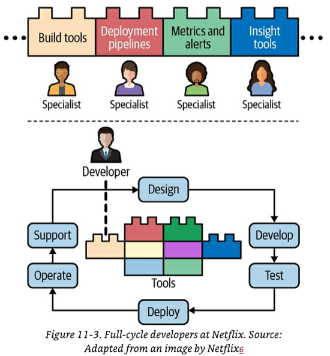

# Chapter 11 - The Human Side of Machine Learning

## User Experience in ML

We've discussed at length how software systems and ML systems are different. This means that there are additional UX challenges in ML systems that you need to consider.  This section overs 3 of those challenges.

### Challenge 1: Ensuring User Experience Consistency
- ML systems may give different predictions to the same user at different points in time. Changes in predictions can cause the UX of your system to feel broken to the user. 
- There are several reasons why a prediction might change from one time to the other.
	- ML systems are probabilistic by nature. This means that there is no guarantee that a given user will get the same prediction every time.
	- Your system may have different information about your user at different points in time, causing different predictions.
- When designing the UX for ML systems you will need to consider the **consistency-accuracy trade-off**:
	- You can decide to give the most accurate / updated prediction risking an inconsistent behaviour for the user OR you can decide to "remember and fix" what a prediction was using some rule to ensure consistency.

### Challenge 2: Combatting "Mostly Correct" Predictions
- A "mostly correct" prediction is when an ML system produces predictions that are "mostly correct" or "look correct" but you  can't guarantee that they are. 
- Expert users in the domain will be able to discern and fix what parts of the prediction are wrong. Inexpert users may not have enough knowledge to discern and may incorrectly accept the given prediction as correct.
- This is very common with Large Language Models (LLMs). For example, you ask an LLM to produce some Java code to solve a problem and the LLM will output some code that looks like plausible Java.
	- An experienced programmer can quickly read the predicted code, fix a couple of things to make it work and use it.
	- An inexperienced programmer my attempt to use it "as is", even if the code is wrong.
- Systems that produce "mostly correct" predictions can be huge time savers for expert users. If your users are of this type, the UX concerns simplify.
- The harder UX challenge is how to correctly present "mostly correct" predictions to non-expert users so that the predictions are still useful but are also not taken at face value.
- A common approach is to show users multiple predictions from the same input to increase the chance of at least one of them being correct.
	- If you are dealing win non-expert users your predictions should be rendered in way that allows them to evaluate the variants. For example, if the output of the model are HTML alternatives, render each.
	- This approach is sometimes referred to "human -in-the-loop". Chip recommends reading ["Rethinking Human-AI interaction" By Jessy Lin](https://jessylin.com/2020/06/08/rethinking-human-ai-interaction/) for more info on this topic.

### Challenge 3: Smooth Failing
- No matter how tuned for speed your model is, you may run into the hard truth that, for certain conditions (like large inputs), your model may take an unacceptable amount of time to make a prediction.
	- This is typical of NLP or time series models: the bigger the text input, the longer it takes. 
	- High prediction latency can also happen for customers with a lot of data in your system. Don't disregard them as they may be your best customers.
- To address this you can:
	- Create a **backup model** that is less accurate but is faster. This backup model can be a 1) heuristic rule, 2)a simpler model or 3) a cached prediction with older data.
	- Decide on a strategy on how to **trigger the backup model.** This trigger can be: 
		- 1) add a timeout to the main model and fallback to the backup if the timeout is reached. 
		- 1) Add a heuristic rule that routes predictions. 
		- 3) Build an auxiliary regression model to predict how long the computation will take in the main model. If you do this, you need to take into account the inference of the regression prediction.
- Smooth failing  is related to the **speed-accuracy trade-off**. Sometimes you prefer to use a less-optimal model that is faster because latency is crucial.
	- With a primary + backup arrangement you can (sort of) choose both speed and accuracy.

## Team Structure
This section will cover aspects of team structure to consider when building ML teams.

### Don't disregard SMEs 
Subject matter experts (doctors, lawyers, farmers, stylists) are often overlooked in the design of ML systems or are only considered during the data labelling phase.

You should consider having SMEs as part of the team or at least involved in all phases beyond the labelling phase: development lifecycle (problem formulation, feature engineering, error analysis, model evaluation, user interface, etc). Their input can make or break your system.

It is important to allow SMEs to make contributions to the project without having to go through engineering for everything. For examples, many companies are building no-code/low-code platforms to allow SMEs to do changes in things like labelling, quality assurance and feedback. More platforms are being developed for other phases like dataset creations and issue investigation.

### Ownership boundaries for data scientists

Companies tend to follow one of these two approaches when deciding the "ownership boundaries" for data scientists.

#### Approach 1: Have a separate team to manage production
The data scientist / ML team develops the model in the [dev environment](10-infrastructure-and-tooling-for-ml-ops.md#Layer%204%20Development%20Environment). Then the model is given to a separate team (e.g. Ops/platform ML engineering team) to put it in prod and run it.

- **Pros**
	- It is easier to hire people with one set of skills than to hire people that know multiple skills at the same time.
	- Makes the lives of every individual easier as they only have to focus on their part of the chain.
- **Cons**
	- Communication and coordination overhead between teams.
	- Debugging becomes hard because when something fails it is not clear who to go to and people are not familiar with each other's code. You need to pull different teams to debug issues.
	- Fosters finger-pointing when things go wrong.
	- Everyone has a narrow context and no one has visibility into the entire end-to-end process. This means that no one sees high impact suggestions on how to improve it.

#### Approach 2: Data scientists own the entire end-to-end process
The data scientist / ML team has to worry about productionizing models.
- **Pros**
	- The opposite of the cons above.
- **Cons**
	- It is unreasonable to expect data scientists to know the low-level infrastructure skills required to put models in prod.
	- You may have a really hard time hiring people with all skills.
	- Your data scientist may spend more time writing infrastructure code than ML code.

#### Wait, if both approaches suck, what do we do?
Having ML teams or data scientists own the entire process end-to-end works better. However, to do this you need to provide them with **good high-level abstractions to deal with areas they are not experts on.**
- Abstract away the complexities like containerisation, distributed processing, automatic failover, etc.

In the "Netflix working model",  specialists from areas like infrastructure, build tools, deployment pipelines, metrics and dashboarding, (among others) first join the project to create tools that automate their parts.  Then the data scientists / ML team uses those tools to own the project end-to-end.
- In other words, build the tooling to develop the project end-to-end, then let the data scientists / ML team iterate using the tools.

## A framework for responsible AI
### Create model cards