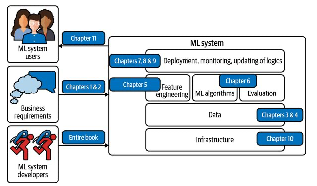
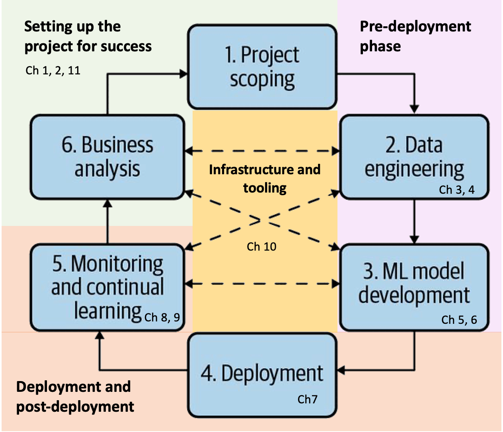

# Summary of Designing Machine Learning Systems 
This is a **very detailed** summary of [Designing Machine Learning Systems](https://www.oreilly.com/library/view/designing-machine-learning/9781098107956/) by Chip Huyen. All credit to her and O'Reilly. 

I took these note for my own learning and future reference. I'm ok with PRs to improve sections.

**Context before you read this book**

- As of 2022, the vast majority of ML applications in production are **supervised ML** models. This book focuses almost exclusively on putting supervised ML models in production.

- This book won't teach you how to do ML modelling. Furthermore it assumes that you have at least a high level understanding of ML modelling. 

# Navigating this Book
This book can be navigated in two ways: 

1. From the perspective of the components of an ML system.
2. From the perspective of the never-ending iterative process required to design, operate and continually improve an ML system in production.

*1. Book navigation from the perspective of the components of an ML system*

*2. Book navigation from the perspective of the iterative process to build ML systems*

## Table of Content

**[Chapter 1: Overview of ML Systems](01-overview-of-ml-systems.md)**
- When to use ML (and when not to)
  - Problem characteristics needed for ML solutions to work
  - Problem characteristics that will make ML solutions especially useful
  - Typical ML use cases
- ML in research vs production
- ML systems vs traditional software

**[Chapter 2: Project objectives, requirements and framing](02-project-objectives-requirements-and-framing.md)**
- The relationship between business and ML objectives 
- Requirements for ML Systems: Reliability, Scalability, Maintainability, Adaptability
- Framing of ML Problems in way that makes your job easier.
  - Types of supervised ML Tasks
  - Objective Function Framing in Multi-objective Applications

**[Chapter 3: Data Engineering Fundamentals](03-data-engineering-fundamentals.md)**
- Quality of the algorithm VS quality and quantity of the data
- Data sources for your ML project
- Choosing the right Data format
- Tradeoffs of the data models to store your data: Structured vs Unstructured
- Data warehouses vs data lakes
- Database engines for transactional processing vs analytical processing (OLTP vs OLAP)
- Data processing ETLs
- Modes of dataflow:  passing data through DBs vs passing through services vs passing through events
- Batch processing vs stream processing

**[Chapter 4: Training Data](04-training-data.md)**

Covers different techniques for creating good training data.
- Sampling techniques to select data for training
- How to tackle common challenges with training data:
	- Labelling problems
	- Class imbalance problems
	- Lack of data problems and data augmentation

**[Chapter 5: Feature engineering](05-feature-engineering.md)**
- Why is  feature engineering still relevant despite neural networks promising to learn the features from raw data.
- Common feature engineering operations
	- Handling missing values: types of missing values and how to fix them
	- Scaling
	- Discretization of continuous features
	- Encoding categorical features: how to handle categories with a dynamic number of values
	- Feature Crossing
	- Discrete and continuous positional embeddings:  helpful for representing order information in models that don't explicitly take into account order (like transformers)
- Data leakage: what it is, what are the common causes and how to detect it
- Engineering good features
	- Feature importance
	- Feature Generalization

**[Chapter 6: Model Development and Offline Evaluation](06-model-development-and-offline-evaluation.md)**
 - Model selection, development and training
	- Criteria to select ML models
	- Ensembles as part of model selection
	- Experiment tracking and versioning during model development.
	- Debugging ML models
	- Modes of Distributed training: data parallelism, model parallelism and pipeline parallelism.
	- AutoML: automatic hyperparameter tuning, auto architecture search and learned optimizers.
- Offline evaluation: How to evaluate your model alternatives to pick the best one
	- Baselines: you need to compare your model against something.
	- Offline evaluation methods beyond overall ML metrics:  Evaluating your models for robustness, fairness, and sanity before picking one and sending it to production.

[**Chapter 7: Model Deployment and Prediction Service**](07-model-deployment-and-prediction-service.md)
- The four modes for serving predictions:
	- 1) Batch prediction that only uses batch features
	- 2) Online prediction that only uses batch features
	- 3) Online prediction that uses both batch features and streaming features (aka streaming prediction)
		- Unifying the Batch Training Pipeline with the Streaming  Serving Pipeline 
	- 4) Hybrid between modes 1 and 2 (batch and online with batch features)
- Faster Inference through Model Compression
	- Low-rank factorization
	- Knowledge Distillation: train a simpler student model to behave like a complex teacher model.
	- Pruning: Identify which nodes in a neural network contribute little to the prediction and either eliminate them or set the weights to zero.
	- Quantization: use less bits to store the weights of a NN. (e.g 16 bits instead of 32 bits)
- ML inference on the Cloud vs on the Edge
	- Pros, Cons and *"When to Use"* for Cloud and Edge
	- Compiling and Optimizing Models for Edge Devices
		- Manual Model Optimization
		- Using ML for Model Optimization
	- ML in browsers

[**Chapter 8: Data distribution shifts and monitoring in production**](08-data-distribution-shifts-and%20monitoring-in-production.md)
- Causes of ML System Failures
	- Software system failures
	- ML-specific failures
		- Extreme data sample edge cases
		- Degenerate feedback loops
	- Data Distribution Shifts: A particularly hairy ML-specific failure
		- Types of distribution shifts
		- Detecting Data Distribution Shifts
			- Detection using accuracy-related metrics
			- Detection using statistical methods
			- Time window considerations for detecting shifts
		- Addressing Data Distribution Shifts
			- Minimizing model sensitivity to shifts
			- Correcting shifts after the model has been deployed
- Monitoring and Observability
	- Software related metrics
	- ML-Specific metrics
		- Monitoring accuracy-related metrics
		- Monitoring predictions
		- Monitoring features
		- Monitoring raw inputs
	- Monitoring toolbox
		- Logs and distributed tracing
		- Dashboards
		- Alerts

**[Chapter 9: Continual Learning and Testing in Production](09-continual-learning-and-test-in-production.md)**
- Continual Learning
	- Why Continual Learning?
	- Concept: Stateless retraining VS Stateful training
	- Concept: feature reuse through log and wait
	- Continual Learning Challenges
	    - Fresh data access challenge
	    - Evaluation Challenge
	    - Data scaling challenge
	    - Algorithm challenge
    - The Four Stages of Continual Learning
        - Stage 1: Manual, stateless retraining
        - Stage 2: Fixed schedule automated stateless retraining
        - Stage 3: Fixed schedule automated stateful training
        - Stage 4: Continual learning
    -  How often to Update your models
        - Measuring the value of data freshness
        - When should I do model iteration?
- Testing models in Production
    - Pre-deployment offline evaluations
    - Testing in Production Strategies
        - Shadow Deployment
        - A/B Testing
        - Canary Release
        - Interleaving Experiments
        - Bandits

**[Chapter 10: Infrastructure and tooling for ML Ops](10-infrastructure-and-tooling-for-ml-ops.md)**
- Infrastructure requirements follow company scale
- Layer 1: Storage and Compute
    - The Storage Layer
    - The Compute Layer
        - Public Clouds VS Private Data Centers
        - Multi-cloud strategies
- Layer 4: Development Environment
    - Standardisation of the dev environment
        - Moving from a local to a cloud dev environment
        - IDEs and cloud dev environments
    - Notebook support in the dev environment
    - From dev to prod: containers
- Layer: 2 Resource Management
    - Some terminology: Cron, Schedulers and Orchestrators
    - Managing workflows for Data science
        - Airflow
        - Prefect
        - Argo
        - Kubeflow and Metaflow
- Layer 3: ML Platform
    - Model Hosting Service
    - Model Store
    - Feature Stores
- The Build vs Buy decision

**[Chapter 11: The human side of ml](11-the-human-side-of-ml.md)**
- User experience in ML
    - Challenge 1: Ensuring User Experience Consistency
    - Challenge 2: Combating "Mostly Correct" Predictions
    - Challenge 3: Smooth Failing
- Team Structured
    - Don't disregard SMEs
    - Ownership boundaries for data scientists
        - Approach 1: Have a separate team to manage production
        - Approach 2: Data scientists own the entire end-to-end process
        - Wait, if both approaches suck, what do we do?
- A framework for responsible AI
    - Discover the sources for model biases
    - Understand the limitations of the data-driven approach
    - Understand the fairness trade-offs that happen when optimising your model for different properties
        - Privacy vs accuracy trade-off
        - Compression vs accuracy fairness trade-off
    - Act early
    - Create model cards
    - Establish company processes for mitigating biases
    - Stay up-to-date on responsible AI

